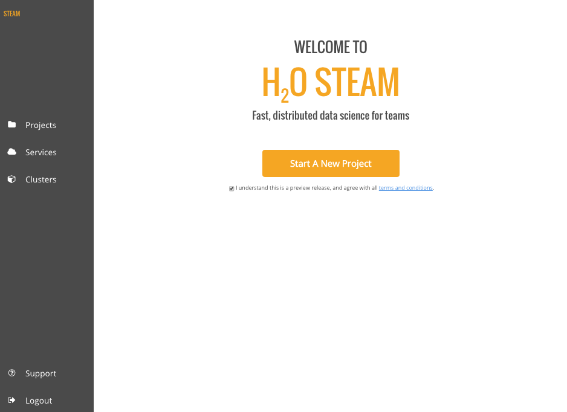

# DEPRECATED
This project is no longer maintained, please consider using [Enteprise Steam](https://www.h2o.ai/download/#enterprise-steam) instead.

# Steam

Steam is an “instant on” platform that streamlines the entire process of building and deploying predictive applications. It is the industry’s first data science hub that lets data scientists and developers collaboratively build, deploy, and refine predictive applications across large scale datasets. Data scientists can publish Python and R code as REST APIs and easily integrate with production applications.

Steam in an open source product that uses AGPL code. (See the [License file](LICENSE).) Contact H2O for information about receiving a licensed version of Steam. 

## Useful Links

Refer to the following for more information:

 - [Contributing to Steam](CONTRIBUTING.md)
 - [Development in Steam](DEVEL.md)
 - [Steam User Guide](http://docs.h2o.ai/steam/latest-stable/steam-docs/index.html)

## Contacting Support

If you're an Open Source community member, you can contact H2O using one of the following methods:

- Click the Support link in the Steam UI to send an e-mail message
- Send an e-mail message directly to <a href="mailto:support@h2o.ai">support@h2o.ai</a>
- Ask your question on [Stack Overflow](https://stackoverflow.com/questions/tagged/h2o) using the "h2o" tag

