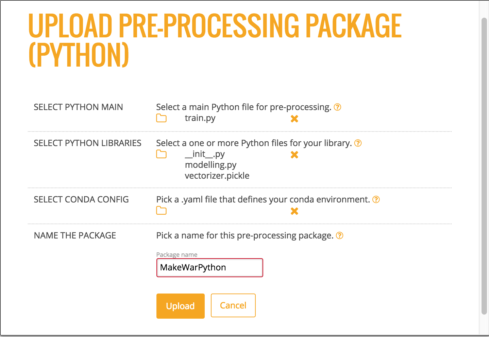

# Steam Standalone Installation and Setup

## Requirements

- Web browser with an Internet connection
- JDK 1.7 or greater
- PostgreSQL 9.1 or greater
	- available from <a href="https://www.postgresql.org/" target="_blank">PostgreSQL.org</a>
	- Note that if you get a permissions error when running ``brew install postgres``, then you may need to change permissions using either ``rm ~/.steam/config`` or ``brew doctor``.
- Steam tar for Linux or OS X 
	- available from <a href="http://www.h2o.ai/steam" target="_blank">www.h2o.ai/steam</a>
- H2O jar file for version 3.10.0.3 or greater
	- available from the <a href="http://www.h2o.ai/download/h2o/choose" target="_blank">H2O Download</a> page
	- If necessary, follow the instructions on the <a href="http://www.h2o.ai/download/h2o/python">http://www.h2o.ai/download/h2o/python</a> or <a href="http://www.h2o.ai/download/h2o/r">http://www.h2o.ai/download/h2o/r</a> page to upgrade H2O for Python or R.

### Optional

The following are required if you use a Python or R demo.

**Python**

- A dataset that will be used to generate a model. This demo uses the well-known iris.csv dataset with headers (available online), and the dataset is saved onto the desktop. 
- Python 2.7

**R**

- A dataset that will be used to generate a model. 
- Comprehensive R Archive Network (R). Available from <a href="https://cran.r-project.org/mirrors.html" target="_blank">https://cran.r-project.org/mirrors.html</a>. 

## Starting Steam

This section describes how to set up and start Steam and start the Steam CLI for user management. Five terminal windows will be open the first time you run this setup; four terminal windows will be open for subsequent logins.

1. Go to <a href="http://www.h2o.ai/steam" target="_blank">www.h2o.ai/steam</a> and download the Steam package. Be sure to accept the EULA.

1. Open a terminal window and untar the Steam binary. Note that the command below untars the OS X binary. Replace `darwin` with `linux` in the steps that follow to build on Linux.

        tar xvf steamY-master-darwin-amd64.tar.gz
    <!-- -->

1. Open a second terminal window and start PostgreSQL. This should be started from the folder where PostgreSQL was installed.

        postgres -D /usr/local/var/postgres
    <!-- -->

1. Open a third terminal window to create a new user for the Steam database. The commands below only need to be performed once. The example below creates a steam **superuser**. ***If prompted, do not enter a password***. 

        createuser -P steam
        Enter password for new role:
        Enter it again:
    <!-- -->

1. Change directories to the Steam /var/master/scripts folder and create the database. 

        cd steam-master-darwin-amd64/var/master/scripts
        ./create-database.sh
   <!-- -->

1. Change directories to your Steam directory, and start the Jetty server.

        cd steam-master-darwin-amd64
        java -jar var/master/assets/jetty-runner.jar var/master/assets/ROOT.war
		
 >***Note***: The Jetty server defaults to port 8080. You can optionally provide a `--port` value for **jetty-runner.jar**.
		
1. Open a fourth terminal window. From within the **steam-master-darwin-amd64** folder, start the Steam compilation and scoring service. Be sure to include the ``--superuser-name=superuser`` and ``--superuser-password=superuser`` flags. (Or provide a more secure password.) This starts Steam on localhost:9000 and creates a Steam superuser. The Steam superuser is responsible for creating roles, workgroups, and users and maintains the H2O cluster.

        ./steam serve master --superuser-name=superuser --superuser-password=superuser

 >***Note***: This starts the Steam web service on `localhost:9000`, the compilation service on `localhost:8080` (same as the Jetty server), and the scoring service on `localhost`. You can change these using `--compilation-service-address=<ip_address:port>` and `--scoring-service-address=<ip_address>`. Use `./steam help serve master` or `./steam serve master -h` to view additional options.

1. Open a fifth terminal window to run CLI commands. From within the Steam folder, log in to the machine running Steam (localhost:9000). Use the superuser login and password that you created in the previous step.

        ./steam login localhost:9000 --username=superuser --password=superuser
   <!-- -->

1. Run the following to verify that the CLI is working correctly.

        ./steam help
		
At this point, you can open a browser and navigate to localhost:9000. Note that you may be prompted to once more provide the login credentials supplied in Step 8. 

The next section describes how to add additional users to the Steam database. 

### Adding Roles, Workgroups, and Users

The following example creates sample roles, workgroups, and users using the CLI. Refer to the <a href="https://github.com/h2oai/steamY/tree/master/docs/cli">CLI Commands</a> in github for information about all of the commands available in the CLI. These commands are run from the terminal window used to log in to Steam ([Step 7](#step7) above).

1. Create an engineer role and link that role to permissions. Note that you can use `./steam get all --permissions` to view all available permissions and their corresponding IDs. 

		./steam create role --name="engineer" --description="a default engineer role"
		RoleId:	2
		./steam link role --with-permission=true --role-id=2 --permission-id=18
		./steam link role --with-permission=true --role-id=2 --permission-id=4
		./steam link role --with-permission=true --role-id=2 --permission-id=12
	<!-- -->
		
1. Create a data scientist role and link that role to permissions.

		./steam create role --name="datascience" --description="a default data scientist role"
		RoleId:	3
		./steam link role --with-permission=true --role-id=3 --permission-id=11
		./steam link role --with-permission=true --role-id=3 --permission-id=17
		./steam link role --with-permission=true --role-id=3 --permission-id=10
	<!-- -->
		
1. Create preparation and production workgroups.

		./steam create workgroup --name="preparation" --description="data prep group"
		WorkgroupId:	2
		./steam create workgroup --name="production" --description="production group"
		WorkgroupId:	3
   <!-- -->
		
1. Create two users - Bob and Jim.

		./steam create identity --name="bob" --password="bobSpassword"
		./steam create identity --name="jim" --password="j1mSpassword"
   <!-- -->
		
1. Link Bob to the engineer role; link Jim to the datascience role.

		./steam link identity --with-role --identity-id=2 --role-id=2
		./steam link identity --with-role --identity-id=3 --role-id=3
   <!-- -->
		
1. Link Bob to the preparation workgroup; link Jim to the production workgroup.

		./steam link identity --with-workgroup --identity-id=2 --workgroup-id=2
		./steam link identity --with-workgroup --identity-id=3 --workgroup-id=3

## Starting H2O and Building a Model

In order to create a project in Steam, your cluster must already have at least a single dataset. This section describes how to start H2O and runs a small Python demo for adding a dataset and building a model. 

### Start H2O

1. Open another terminal window. Navigate to the folder with your H2O jar file and start H2O. This will create a one-node cluster on your local machine on port 54321.

		cd ~/Downloads/h2o-3.10.0.3
		java -jar h2o.jar 

### Build a Model

The following steps show how to build model using the Iris dataset and the GBM algorithm. The steps will be run using H2O in Python. Once created, the model can be selected in Steam when creating a new project.

>**Note**: The rest of section can be skipped if you already have demo steps that you use in R, Python, or Flow. If you use another demo, be sure that you initialize H2O on your local cluster so that the data will be available in Steam. 

 >	Additional demos for Python are available <a href="https://github.com/h2oai/h2o-3/tree/master/h2o-py/demos" target="_blank">here</a>.
 
 > Demos for R are available <a href="https://github.com/h2oai/h2o-3/tree/master/h2o-r/demos" target="_blank">here</a>. 
 
 > A demo of Flow can be viewed <a href="https://www.youtube.com/watch?feature=player_embedded&v=wzeuFfbW7WE" target="_blank">here</a>. 

1. Open a terminal window. Change directories to the H2O folder, and start Python. Import the modules that will be used for this demo. 

        $ cd ~/Downloads/h2o-3.10.0.3
        $ python
        >>> import h2o
        >>> from h2o.estimators.gbm import H2OGradientBoostingEstimator
   <!-- -->

1. Initialize H2O using localhost and port 54321. (Note that if started Steam on a different machine, then replace `localhost` with the IP address of that machine.)

        >>> h2o.init(ip="localhost", port=54321)
        ------------------------------  -------------------------------------
        H2O cluster uptime:             2 minutes 37 seconds 168 milliseconds
        H2O cluster version:            3.10.0.3
        H2O cluster name:               user
        H2O cluster total nodes:        1
        H2O cluster total free memory:  3.35 GB
        H2O cluster total cores:        8
        H2O cluster allowed cores:      8
        H2O cluster healthy:            True
        H2O Connection ip:              127.0.0.1
        H2O Connection port:            54321
        H2O Connection proxy:
        Python Version:                 2.7.9
        ------------------------------  -------------------------------------

 >**Note**: After initializing, verify that the H2O cluster version is 3.10.0.3 or greater. Steam will not run on earlier versions. If necessary, follow the instructions on the <a href="http://www.h2o.ai/download/h2o/python">http://www.h2o.ai/download/h2o/python</a> or <a href="http://www.h2o.ai/download/h2o/r">http://www.h2o.ai/download/h2o/r</a> page to upgrade H2O for Python or R.

3. Upload the Iris dataset. Note that in this example, Python is running from the Downloads folder, and the Iris dataset is on the Desktop:

        >>> df=h2o.upload_file("../../Desktop/iris.csv")
   <!-- -->

4. Specify the configuration options to use when building a GBM model.

        >>> gbm_regressor = H2OGradientBoostingEstimator(distribution="gaussian", ntrees=10, max_depth=3, min_rows=2, learn_rate="0.2")
   <!-- -->

5. Train the model using the Iris dataset (`df` object) and the GBM configuration options. 

        >>> gbm_regressor.train(x=range(1, df.ncol), y=0, training_frame=df)
   <!-- -->

6. Optionally view the model details.

        >>> gbm_regressor

Once created, the model can be added to the Steam UI. 

# Projects

Steam makes use of project-based machine learning. Whether you are trying to detect fraud or predict user retention, the datasets, models, and test results are stored and saved in the individual projects. All Steam users within your environment can access these projects and the files within them.

## Creating a Steam Project

Now that you have added files to your H2O cluster, you can create your first Steam project. Point your browser to the Steam URL, for example, http://localhost:9000/.
 
1. To start a new project from scratch, click **Create New Project**.  

 

2. When you first log in to Steam, the list of clusters will be empty. Enter the IP address of the cluster that is running H2O, then click **Connect**. Once connected, the current list of clusters will immediately populate with this cluster. Connect to this cluster to continue.
3. Select an available H2O frame from the Datasets dropdown, then select the Category. Note that these dropdowns are automatically populated with information from datasets that are available on the selected cluster. If no datasets are available, the the dataset list will be empty. For clusters that contain datasets, after a dataset is selected, a list of corresponding models will display.
4. Select the checkbox beside the model(s) to import into the Steam project. In this example, two models are available on the H2O cluster: one model built using GBM and one model built using GLM. 
5. Specify a name for the project.

 

6. Click **Create Project** when you are done. Upon successful completion, the Models page will be populated with the model(s) that you added to your project, and the new project will be available on the **Projects** page.

 

7. On the **Projects** page, click on the newly created project. This opens a submenu allowing you to view the imported models, deployed models, and configurations specific to that project. Information about these topics is available in the sections that follow.

 
 
## Models

The **Models** page shows a list of all models included in a selected Project. This list also includes summary information for each model. This information varies based on whether the model is binomial or regresssion.

For binomial models, the following values will display on the Models page.

- AUC
- Gini
- MSE
- Logloss
- ROC

For regression models, the following values will display on the Models page.

- MRD
- MSE
- R^2

You can perform the following actions directly from this page:

- Import a new model
- View model details and export the model as a java, jar, or war file 
- Label a model (Refer to [Configurations](#configurations) for information on how to create labels.)
- Deploy the model

>**Note**: The Models page lists models in alphabetical order and shows five models per page. If your project includes more than five models, use the forward and back arrows at the bottom of the page to view more models. 

### Importing Models

After models are added to an H2O cluster, they can be imported into an existing Steam project. In the upper-right corner of the Models page, click the **Import Models** button. This opens an Import Models popup form.

The Cluster dropdown automatically populates with a list H2O clusters. Specify the H2O cluster that has the models you want to import, then select the additional model or models that you want to add to the project. 

Click **Import** when you are done. The newly added models will then appear on the Models page.

### Viewing Model Details

On the **Models** page, click the **view model details** link under the Action column for the model that you want to view.

This page provides information about when the model was created, the algorithm and dataset used to create the model, and the response column specified when the model was built. The Goodness of Fit section provides value information for the model, including the Mean Squared Error, LogLoss, R^2, AUC, and Gini score. An ROC curve is available for binomial models.  

From this page, you can perform the following actions:

- [Compare two models](#comparemodels)
- [Deploy the model](#deploymodel)
- [Export the model](#exportmodel)

#### Comparing Models

1. While viewing model details, click the **Compared To** field. This opens a popup showing all models available in the current project.  

 

2. Select to compare the current model with any available model. This exampel compares a GLM model with a GBM model. Once a model is selected, the Model Details page immediately populates with the comparison information. The current model values are displayed in blue, and the selected comparison model displays in orange.

 

#### Deploying a Model

After comparing models, you might decide to deploy one or more of the best models. Perform the steps below to deploy a model. 

1. While viewing the model details, click the **Deploy Model** button. (Note that this can also be done directly from the **Models** page by selecting the **deploy model** link in the Action column.)
2. Specify a service name for the deployment.
3. To perform pre-processing on the model, specify a Preprocessing Script. Note that this dropdown is populated with scripts that are added to the project. Information about adding preprocessing scripts is available in the [Deployment](#deployment) section. 
4. Click **Deploy** when you are done.

 

3. Upon successful completion, a scoring service will be created for this deployed model. Click the **Deployment** menu option on the left navigation to go to the Deployment page. Refer to the [Deployment](#deployment) section for more information. 

 

#### Exporting a Model

Steam allows you to export models to your local machine. 

1. While viewing the model details, click the **Export Model** button. 
2. Specify whether to export the model as a .java, .jar, or .war file.
3.  To perform pre-processing on the model during the export, specify a Preprocessing Script. Note that this dropdown is populated with scripts that are added to the project. Information about adding preprocessing scripts is available in the [Deployment](#deployment) section. 
4. Click **Download** when you are done.

 

# Deployment

The **Deployment** page lists all available deployed services. For each deployed service, this page shows the model name, model ID, and the status. You can stop a running service by clicking the **Stop Service** button 

In addition to showing deployed services, a Packaging tab is available showing the preprocessing packages used in the deployment.

### Uploading a New Package

Preprocessing packages can be used to perform additional data munging on an existing model. 

1. To upload a new preprocessing package, click the **Upload New Package** button in the upper-right corner of the Deployment page.
2. Specify the main Python file that will be used for preprocessing. Click on the folder link to browse for this file.
3. Specify additional files that may be dependencies of the main Python preprocessing file.
4. Enter a name for this new package.
5. Click **Upload** when you are finished.

Upon successful completion, the new preprocessing package will display on the Packages tab of the Deployment page. This file can then be specified when deploying or exporting models. (Refer to [Deploying a Model](#deploymodel) or [Exporting a Model](#exportmodel).)

### Making Predictions

1. To reach the Steam Prediction Service, click the IP address link listed under the Deployed Services for the deployed model that you want to score. This opens Steam Prediction Service tool. The fields that display on the Prediction Service tool are automatically populated with field information from the deployed model.

 

2. Make predictions by specifying input values based on column data from the original dataset. This automatically populates the fields in the query string. (Note that you can optionally include input parameters directly in the query string instead of specifying parameters.)

3. Click **Predict** when you are done. 

>**Note**: Use the **Clear** button to clear all entries and begin a new prediction. Use the **More Stats** button to view additional statistics about the scoring service results.

## Configurations

Steam allows you to set labels for models (such as Production, Test, etc.) and apply permissions for using the labels. The Steam admin/superuser is responsible for creating new Steam users and setting roles and workgroups for those users. When setting Steam project configurations, labels can be created that allow, for example, only users in a Production workgroup to label a model as a production model. 

When a label is applied to a model, the Project Configurations page will show all models associated with a label.

### Creating a New Label

1. On the Configurations page, click the **Create New Label** button.
2. Enter a unique name for the label, the provide a description.
3. Click **Save** when you are done.

Upon successful completion, the new label will display on the Project Configurations page and can be edited or deleted. This label will also be available on the Models page in the **label as** dropdown. The following image shows two labels in the **label as** dropdown: deploy and test.

 

# Clusters

The **Clusters** page shows all H2O clusters that Steam is connected to along with the status of the cluster. From this page, you can click the link to access H2O Flow (see next section), or delete a cluster using the trashcan icon.

   
   
# Using Steam with H2O Flow

As with other H2O products, Flow can be used alongside Steam when performing machine learning tasks. On the **Clusters** page, click the link for the H2O cluster that you want to open. 

This opens H2O Flow in a new tab.

   

>**Note**: Refer to the H2O Flow documentation for information on how to use Flow. 

## Stopping Steam

When you are finished using Steam, press Ctrl+C in each of the Steam, Compilation Service, and postgres terminal windows to stop the services end your session. 

## What's Next?
 
Now that you have completed your first demo, you are ready to begin creating models using your own data.  

