
# Steam Standalone Guide

This document describes how to get up and running with Steam without the need for a local running instance of YARN. These instructions will walk through the following procedures:

- Installing and starting Steam, the Compilation Service, and H2O
- Adding Roles, Workgroups, and Users to the database
- Building a simple model in Python (Optional for users who don't have an existing demo.)
- Deploying the model using Steam
- Making predictions using the Steam Prediction Service

These steps were created using H2O version 3.10.0.7, and that version resides in a Downloads folder. Wherever used, this version number and path should be adjusted to match your version and path.

# Installation and Setup

## Requirements

-  Chrome browser with an Internet connection. Note that Chrome is currently the only supported browser.
-  Steam tar file
   -  available from the <a href="http://h2o.ai/download">H2O Download</a> site

-  JDK 1.7 or greater
-  H2O jar file for version 3.10.0.7 or greater

   -  available from the H2O Download page
   -  If necessary, follow the instructions on the
      <a href="http://www.h2o.ai/download/h2o/python">http://www.h2o.ai/download/h2o/python</a> or
      <a href="http://www.h2o.ai/download/h2o/r">http://www.h2o.ai/download/h2o/r</a> page to upgrade H2O for Python or R.

### Optional

The following are required if you use a Python or R demo.

**Python**

- A dataset that will be used to generate a model. This demo uses the well-known iris.csv dataset with headers (available online), and the dataset is saved onto the desktop. 
- Python 2.7

**R**

- A dataset that will be used to generate a model. 
- Comprehensive R Archive Network (R). Available from <a href="https://cran.r-project.org/mirrors.html" target="_blank">https://cran.r-project.org/mirrors.html</a>. 

## Starting Steam

This section describes how to set up and start Steam and start the Steam CLI for user management.

1. Go to the <a href="http://h2o.ai/download">H2O Download</a> site and download Steam. 

2. Change directories to the Steam download file and untar the file.
    
		cd ~/Downloads/steam-1.0.0-darwin-amd64
		tar -xzvf steam-1.0.0-darwin-amd64.tar.gz 

3. Change directories to your Steam directory, and start the Jetty server.

        cd steam-master-darwin-amd64
        java -jar var/master/assets/jetty-runner.jar var/master/assets/ROOT.war
		
 >***Note***: The Jetty server defaults to port 8080. You can optionally provide a `--port` value for **jetty-runner.jar**.
		
4. Open another terminal window. From within the **steam-master-darwin-amd64** folder, start the Steam compilation and scoring service. Be sure to include the ``--superuser-name=superuser`` and ``--superuser-password=superuser`` flags. (Or provide a more secure password.) This starts Steam on localhost:9000 and creates a Steam superuser. The Steam superuser is responsible for creating roles, workgroups, and users and maintains the H2O cluster.

        ./steam serve master --superuser-name=superuser --superuser-password=superuser

 This starts the Steam web service on `localhost:9000`, the compilation service on `localhost:8080` (same as the Jetty server), and the scoring service to the external IP address of `localhost`. You can change these using `--compilation-service-address=<ip_address:port>` and `--scoring-service-address=<ip_address>`. Use `./steam help serve master` or `./steam serve master -h` to view additional options.
 
 >***Note***: If you are demoing Steam and do not have an Internet connection, you can set the scoring service to point to localhost using `--scoring-service-address=localhost`. 

5. Open another terminal window to run CLI commands. From within the Steam folder, log in to the machine running Steam (localhost:9000). Use the superuser login and password that you created in the previous step.

        ./steam login localhost:9000 --username=superuser --password=superuser
   <!-- -->

6. Run the following to verify that the CLI is working correctly.

        ./steam help
		
At this point, you can open a browser and navigate to localhost:9000. Note that you may be prompted to once more provide the login credentials created in Step 4. 

The next section describes how to add additional users to the Steam database. 

### Adding Roles, Workgroups, and Users

The following example creates sample roles, workgroups, and users using the CLI. Refer to the Appendix at the end of this document or to the <a href="https://github.com/h2oai/steamY/tree/master/docs/cli">CLI Commands</a> in GitHub for information about all of the commands available in the CLI.

1. Create an engineer role and link that role to permissions. Note that you can use `./steam get all --permissions` to view all available permissions and their corresponding IDs. 

		./steam create role --name="engineer" --description="a default engineer role"
		RoleId:	2
		./steam link role --with-permission=true --role-id=2 --permission-id=18
		./steam link role --with-permission=true --role-id=2 --permission-id=4
		./steam link role --with-permission=true --role-id=2 --permission-id=12
	<!-- -->
		
1. Create a data scientist role and link that role to permissions.

		./steam create role --name="datascience" --description="a default data scientist role"
		RoleId:	3
		./steam link role --with-permission=true --role-id=3 --permission-id=11
		./steam link role --with-permission=true --role-id=3 --permission-id=17
		./steam link role --with-permission=true --role-id=3 --permission-id=10
	<!-- -->
		
1. Create preparation and production workgroups.

		./steam create workgroup --name="preparation" --description="data prep group"
		WorkgroupId:	2
		./steam create workgroup --name="production" --description="production group"
		WorkgroupId:	3
   <!-- -->
		
1. Create two users - Bob and Jim.

		./steam create identity --name="bob" --password="bobSpassword"
		./steam create identity --name="jim" --password="j1mSpassword"
   <!-- -->
		
1. Link Bob to the engineer role; link Jim to the datascience role.

		./steam link identity --with-role --identity-id=2 --role-id=2
		./steam link identity --with-role --identity-id=3 --role-id=3
   <!-- -->
		
1. Link Bob to the preparation workgroup; link Jim to the production workgroup.

		./steam link identity --with-workgroup --identity-id=2 --workgroup-id=2
		./steam link identity --with-workgroup --identity-id=3 --workgroup-id=3

## Starting H2O and Building a Model

In order to create a project in Steam, your cluster must already have at least a single dataset. This section describes how to start H2O and runs a small Python demo for adding a dataset and building a model. 

### Start H2O

1. Open another terminal window. Navigate to the folder with your H2O jar file and start H2O. This will create a one-node cluster on your local machine on port 54321.

		cd ~/Downloads/h2o-3.10.0.3
		java -jar h2o.jar 

### Build a Model

The following steps show how to build model using the Iris dataset and the GBM algorithm. The steps will be run using H2O in Python. Once created, the model can be selected in Steam when creating a new project.

>**Note**: The rest of section can be skipped if you already have demo steps that you use in R, Python, or Flow. If you use another demo, be sure that you initialize H2O on your local cluster so that the data will be available in Steam. 

 >	Additional demos for Python are available <a href="https://github.com/h2oai/h2o-3/tree/master/h2o-py/demos" target="_blank">here</a>.
 
 > Demos for R are available <a href="https://github.com/h2oai/h2o-3/tree/master/h2o-r/demos" target="_blank">here</a>. 
 
 > A demo of Flow can be viewed <a href="https://www.youtube.com/watch?feature=player_embedded&v=wzeuFfbW7WE" target="_blank">here</a>. 

1. Open a terminal window. Change directories to the H2O folder, and start Python. Import the modules that will be used for this demo. 

        $ cd ~/Downloads/h2o-3.10.0.3
        $ python
        >>> import h2o
        >>> from h2o.estimators.gbm import H2OGradientBoostingEstimator
   <!-- -->

1. Initialize H2O. By default, this starts H2O on localhost and port 54321. (Note that if started Steam on a different machine, then replace `localhost` with the IP address of that machine.)

        >>> h2o.init()
		Checking whether there is an H2O instance running at http://localhost:54321..... not found.
		Attempting to start a local H2O server...
		  Java Version: java version "1.8.0_25"; Java(TM) SE Runtime Environment (build 1.8.0_25-b17); Java HotSpot(TM) 64-Bit Server VM (build 25.25-b02, mixed mode)
		  Starting server from /usr/local/h2o_jar/h2o.jar
		  Ice root: /var/folders/yl/cq5nhky53hjcl9wrqxt39kz80000gn/T/tmpKiBrI1
		  JVM stdout: /var/folders/yl/cq5nhky53hjcl9wrqxt39kz80000gn/T/tmpKiBrI1/h2o_techwriter_started_from_python.out
		  JVM stderr: /var/folders/yl/cq5nhky53hjcl9wrqxt39kz80000gn/T/tmpKiBrI1/h2o_techwriter_started_from_python.err
		  Server is running at http://127.0.0.1:54321
		Connecting to H2O server at http://127.0.0.1:54321... successful.

 >**Note**: After initializing, verify that the H2O cluster version is 3.10.0.3 or greater. Steam will not run on earlier versions. If necessary, follow the instructions on the <a href="http://www.h2o.ai/download/h2o/python">http://www.h2o.ai/download/h2o/python</a> or <a href="http://www.h2o.ai/download/h2o/r">http://www.h2o.ai/download/h2o/r</a> page to upgrade H2O for Python or R.

3. Upload the Iris dataset. Note that in this example, Python is running from the Downloads folder, and the Iris dataset is on the Desktop:

        >>> df=h2o.upload_file("../../Desktop/iris.csv")
   <!-- -->

4. Specify the configuration options to use when building a GBM model.

        >>> gbm_regressor = H2OGradientBoostingEstimator(distribution="gaussian", ntrees=10, max_depth=3, min_rows=2, learn_rate=0.2)
   <!-- -->

5. Train the model using the Iris dataset (`df` object) and the GBM configuration options. 

        >>> gbm_regressor.train(x=range(1, df.ncol), y=0, training_frame=df)
   <!-- -->

6. Optionally view the model details.

        >>> gbm_regressor

Once created, the model can be added to the Steam UI. 

# Projects

Steam makes use of project-based machine learning. Whether you are trying to detect fraud or predict user retention, the datasets, models, and test results are stored and saved in the individual projects. All Steam users within your environment can access these projects and the files within them.

## Creating a Steam Project

Now that you have added files to your H2O cluster, you can create your first Steam project. Point your browser to the Steam URL, for example, http://localhost:9000/.
 
1. Click **Start New Project**.  
 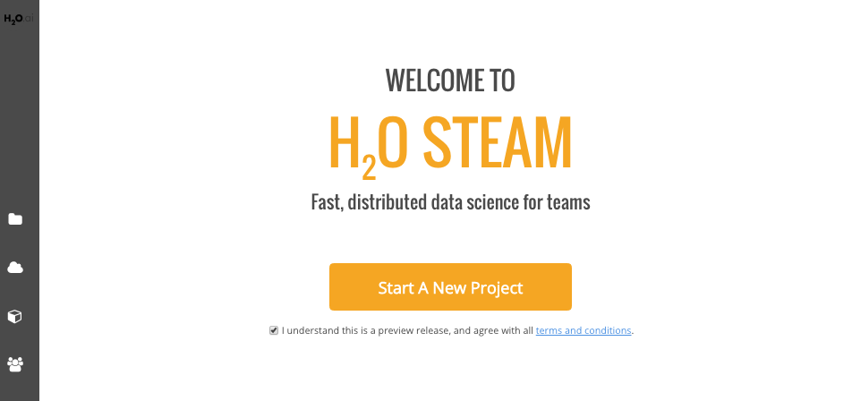
1. When you first log in to Steam, the list of clusters will be empty. Enter the IP address of the cluster that is running H2O, then click **Connect**. 
1. Once connected, the current list of clusters will immediately populate with the cluster's information. Click **Connect** beside this cluster to continue.
 
1. Select an available H2O frame from the Datasets dropdown, then select the Model Category. Note that these dropdowns are automatically populated with information from datasets that are available on the selected cluster. If no datasets are available, then the dropdown lists will be empty. For clusters that contain datasets, after a dataset is selected, a list of corresponding model will display.
1. Select the checkbox beside the model(s) to import into the Steam project.
1. Specify a name for the project.
 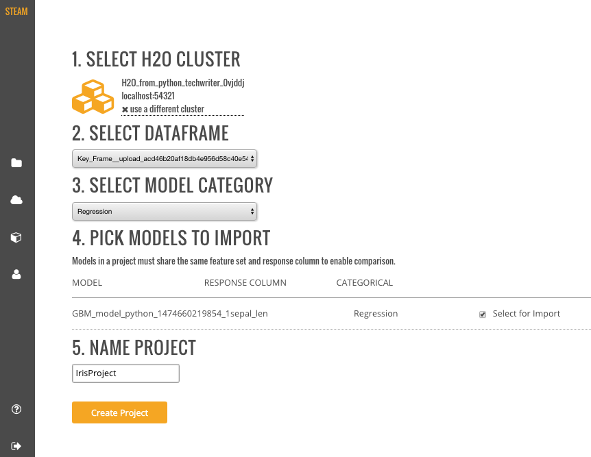
1. Click **Create Project** when you are done. Upon successful completion, the Models page will be populated with the model(s) that you added to your project, and the new project will be available on the **Projects** page.
1. On the **Projects** page, click on the newly created project. This opens a submenu allowing you to view the imported models, deployed models, and configurations specific to that project. Information about these topics is available in the sections that follow.

 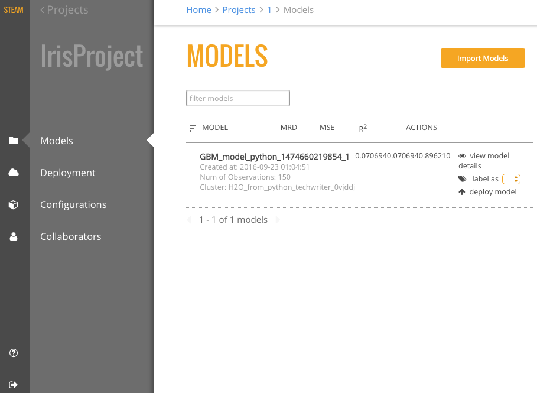
 
## Models

The **Models** page shows a list of all models included in a selected Project. This list also includes summary information for each model. This information varies based on whether the model is binomial or regresssion.

For binomial models, the following values will display on the Models page.

- AUC
- Gini
- MSE
- Logloss
- ROC

For regression models, the following values will display on the Models page.

- MRD
- MSE
- R^2

You can perform the following actions directly from this page:

- Import a new model
- View model details and export the model as a java, jar, or war file 
- Label a model (Refer to [Configurations](#configurations) for information on how to create labels.)
- Deploy the model

>**Note**: The Models page lists models in alphabetical order and shows five models per page. If your project includes more than five models, use the forward and back arrows at the bottom of the page to view more models. 

### Importing Models

After models are added to an H2O cluster, they can be imported into an existing Steam project. In the upper-right corner of the Models page, click the **Import Models** button. This opens an Import Models popup form.

The Cluster dropdown automatically populates with a list H2O clusters. Specify the H2O cluster that has the models you want to import, then select the additional model or models that you want to add to the project. 

Click **Import** when you are done. The newly added models will then appear on the Models page.

### Viewing Model Details

On the **Models** page, click the **view model details** link under the Action column for the model that you want to view.

This page provides information about when the model was created, the algorithm and dataset used to create the model, and the response column specified when the model was built. The Goodness of Fit section provides value information for the model, including the Mean Squared Error, LogLoss, R^2, AUC, and Gini score. An ROC curve is available for binomial models.  

From this page, you can perform the following actions:

- [Compare two models](#comparemodels)
- [Deploy the model](#deploymodel)
- [Export the model](#exportmodel)

#### Comparing Models

1. While viewing model details, click the **Compared To** field. This opens a popup showing all models available in the current project.  

 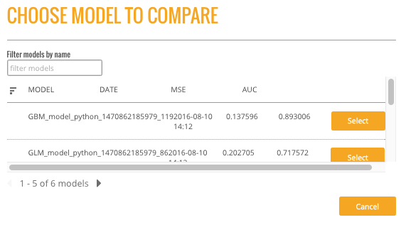

2. Select to compare the current model with any available model. This exampel compares a GLM model with a GBM model. Once a model is selected, the Model Details page immediately populates with the comparison information. The current model values are displayed in blue, and the selected comparison model displays in orange.

 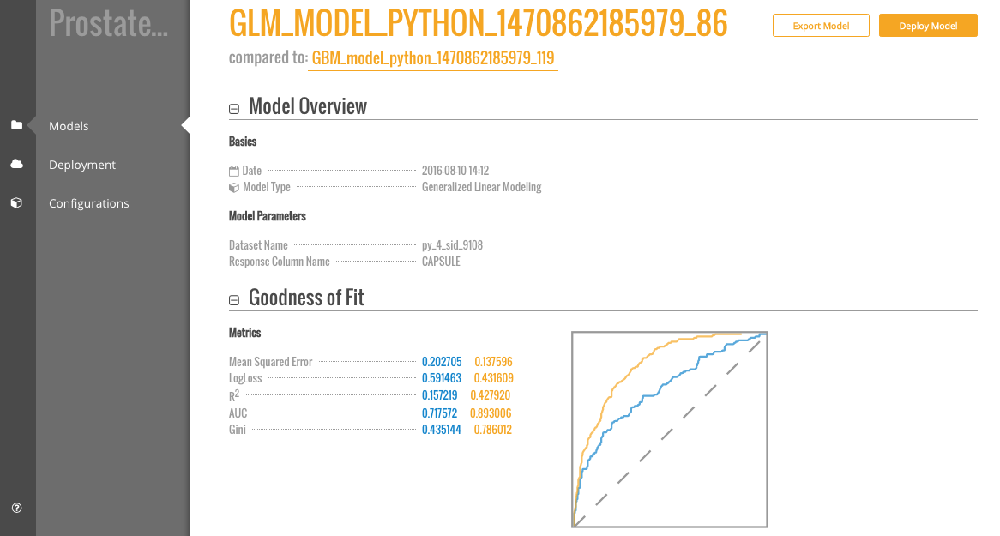

#### Deploying a Model

After comparing models, you might decide to deploy one or more of the best models. Perform the steps below to deploy a model. 

1. While viewing the model details, click the **Deploy Model** button. (Note that this can also be done directly from the **Models** page by selecting the **deploy model** link in the Action column.)
2. Specify a service name for the deployment.
3. To perform pre-processing on the model, specify a Preprocessing Script. Note that this dropdown is populated with scripts that are added to the project. Information about adding preprocessing scripts is available in the [Deployment](#deployment) section. 
4. Click **Deploy** when you are done.

 

3. Upon successful completion, a scoring service will be created for this deployed model. Click the **Deployment** menu option on the left navigation to go to the Deployment page. Refer to the [Deployment](#deployment) section for more information. 

 

#### Exporting a Model

Steam allows you to export models to your local machine. 

1. While viewing the model details, click the **Export Model** button. 
2. Specify whether to export the model as a .java, .jar, or .war file.
3.  To perform pre-processing on the model during the export, specify a Preprocessing Script. Note that this dropdown is populated with scripts that are added to the project. Information about adding preprocessing scripts is available in the [Deployment](#deployment) section. 
4. Click **Download** when you are done.

 

## Deployment

The **Deployment** page lists all available deployed services. For each deployed service, this page shows the model name, model ID, and the status. You can stop a running service by clicking the **Stop Service** button 

In addition to showing deployed services, a Packaging tab is available showing the preprocessing packages used in the deployment.

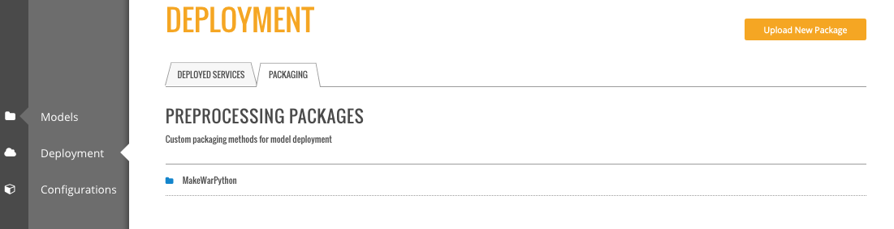

### Uploading a New Package

Preprocessing packages can be used to perform additional data munging on an existing model. 

1. To upload a new preprocessing package, click the **Upload New Package** button in the upper-right corner of the Deployment page.
2. Specify the main Python file that will be used for preprocessing. Click on the folder link to browse for this file.
3. Specify additional files that may be dependencies of the main Python preprocessing file.
4. Enter a name for this new package.
5. Click **Upload** when you are finished.

Upon successful completion, the new preprocessing package will display on the Packages tab of the Deployment page. This file can then be specified when deploying or exporting models. (Refer to [Deploying a Model](#deploymodel) or [Exporting a Model](#exportmodel).)

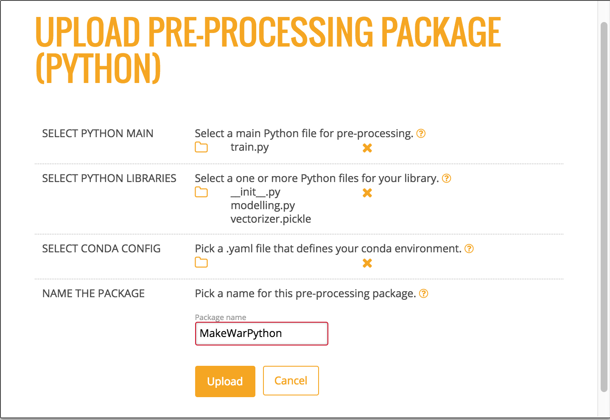

### Making Predictions

1. To reach the Steam Prediction Service, click the IP address link listed under the Deployed Services for the deployed model that you want to score. This opens Steam Prediction Service tool. The fields that display on the Prediction Service tool are automatically populated with field information from the deployed model.

 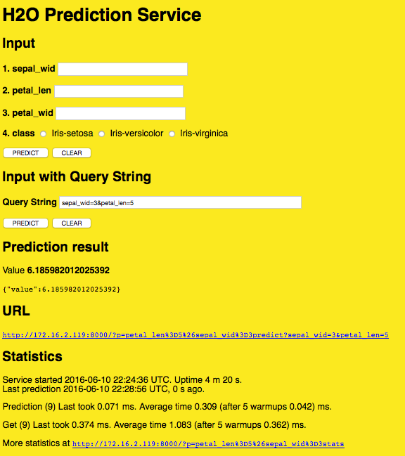

2. Make predictions by specifying input values based on column data from the original dataset. This automatically populates the fields in the query string. (Note that you can optionally include input parameters directly in the query string instead of specifying parameters.)

3. Click **Predict** when you are done. 

>**Note**: Use the **Clear** button to clear all entries and begin a new prediction. Use the **More Stats** button to view additional statistics about the scoring service results.

## Configurations

Steam allows you to set labels for models (such as Production, Test, etc.) and apply permissions for using the labels. The Steam admin/superuser is responsible for creating new Steam users and setting roles and workgroups for those users. When setting Steam project configurations, labels can be created that allow, for example, only users in a Production workgroup to label a model as a production model. 

When a label is applied to a model, the Project Configurations page will show all models associated with a label.

### Creating a New Label

1. On the Configurations page, click the **Create New Label** button.
2. Enter a unique name for the label, the provide a description.
3. Click **Save** when you are done.

Upon successful completion, the new label will display on the Project Configurations page and can be edited or deleted. This label will also be available on the Models page in the **label as** dropdown. The following image shows two labels in the **label as** dropdown: deploy and test.

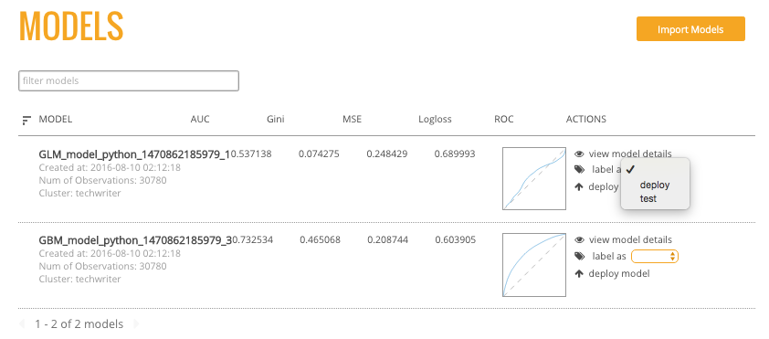 

## Collaborators

The Collaborators page shows the users who have been added to the Steam database as well as the Labels Access (permissions) assigned to each user. Currently, users can only be added by the Steam superuser using the CLI.

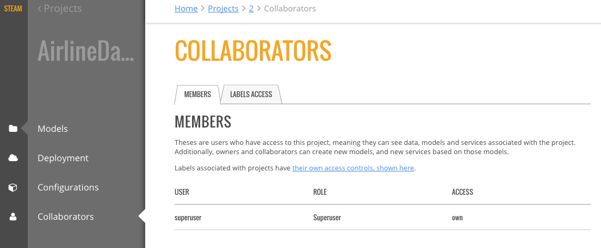
   
# Clusters

The **Clusters** page shows all H2O clusters that Steam is connected to along with the status of the cluster. From this page, you can click the link to access H2O Flow (see next section), launch a new cluster, or delete a cluster.

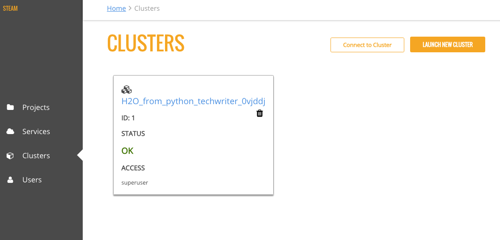

## Launch a New Cluster

You can connect to additional clusters that are running H2O by clicking the **Launch New Cluster** button.

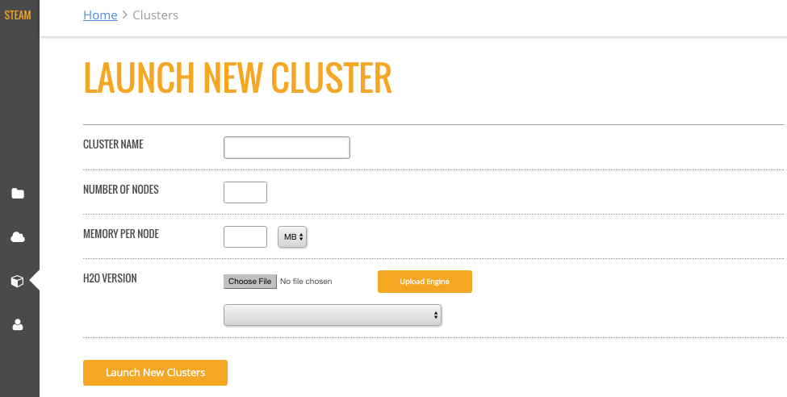

1. On the Launch New Cluster form, enter the following information:

 - Cluster Name
 - Number of Nodes
 - Memory per Node (in MB or GB)
 - H2O version (specifying a jar file)

2. Click **Launch New Clusters** when you are done. 

# Users

The Users page includes a list of all users are have been added to the Steam database along with the user's role. Note that currently, only Steam superusers can add users and roles. 

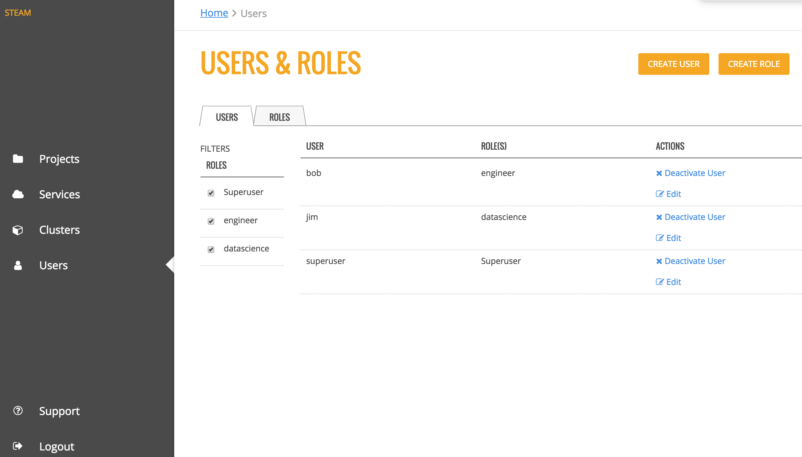

The Roles tab provides a table of the permissions assigned to each role.

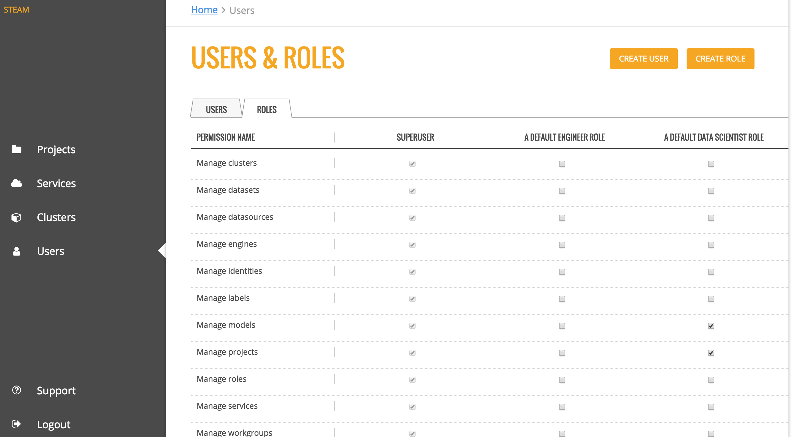

   
# Using Steam with H2O Flow

As with other H2O products, Flow can be used alongside Steam when performing machine learning tasks. On the **Clusters** page, click the link for the H2O cluster that you want to open. 

This opens H2O Flow in a new tab.

   

>**Note**: Refer to the H2O Flow documentation for information on how to use Flow. 

## Stopping Steam

When you are finished using Steam, press Ctrl+C in each of the Steam, Compilation Service, and postgres terminal windows to stop the services end your session. 

## What's Next?
 
Now that you have completed your first demo, you are ready to begin creating models using your own data.  

# CLI Command Reference Appendix

This document describes the CLI commands available in Steam. In addition to this reference, you can view information about each command when you're in the CLI by typing ``./steam help``.

--------------

``add engine``
--------------

**Description**

Adds a new engine to the Steam database. After an engine is successfully
added, it can be specified when starting a cluster. (See
[start cluster](#startcluster).)

**Usage**

    ./steam add engine --engine-name="[name]" --engine-path="[path]"

**Parameters**

-  ``--engine-name="[name]"``: Enter the name of the engine
-  ``--engine-path="[path]"``: Enter the path for the engine

**Example**

The following example adds **h2o-genmodel.jar** to the list of available
engines.

::

    ./steam add engine --engine-name="h2o-genmodel.jar" --engine-path="../Desktop/engines"

--------------

``build model``
---------------

**Description**

Builds a model using either a specified algorithm or through AutoML.

**Usage**

    ./steam build model --cluster-id="[cluster]" --dataset-id="[dataset]" --algorithm="[algorithm]"

    ./steam build model --auto --cluster-id="[cluster]" --dataset-id="[dataset]" --target-name="[model_name]" --max-run-time="[seconds]"

**Parameters**

-  ``--cluster-id="[cluster]"``: Specify the ID of the cluster that
   contains the dataset and will contain this model
-  ``--dataset-id="[dataset]"``: Specify the ID of the dataset to use to
   build the model
-  ``--algorithm="[algorithm]"``: Specify the algorithm to use for the
   model. This option cannot be used with ``--auto``. Options include:

   -  ``gbm``: Build a Gradient Boosting Machine model
   -  ``glm``: Build a Generalized Linear model
   -  ``glrm``: Build a Generalized Low Rank model
   -  ``rf``: Build a Random Forest model
   -  ``svm``: Build a Support Vector Machine model
   -  ``dl``: Build a Deep Learning model
   -  ``nb``: Build a Naive Bayes model

-  ``--auto``: Specify to use AutoML to build the model
-  ``--target-name=[model_name]``: Specify a name for the AutoML model
-  ``--max_run_time``: When building an AutoML model, speicfy the
   maximum runtime in seconds to allow for the model to build.

**Example**

The following example builds a gbm model from the airlines dataset. This dataset was added using [create dataset](#createdataset) and has an ID of 1.

    ./steam build model --cluster-id="1" --dataset-id="1" --algorithm="gbm"

--------------

``create dataset``
------------------

**Description**

Creates a dataset from an available source file. Once created, the
dataset can be used to build a model.

**Usage**

    ./steam create dataset --cluster-id=[cluster] --datasource-id=[source] --name="[datasetname]" --description="[description]" --response-column-name="[column]"

**Parameters**

-  ``--cluster-id=[cluster]``: Specify the ID of the cluster running H2O
   that will contain this dataset
-  ``--datasource-id=[source]``: Specify the ID of the datasource that
   will be used to create this dataset
-  ``--name="[datasetname]"``: Optionally enter a name for this dataset
-  ``--description="[description]"``: Optionally provide a description
   for this dataset
-  ``--response-column-name="[column"]``: Specify the column that will
   be used when making predictions

**Example**

The following example creates a dataset from a source file that was added using [create datasource](#createdatasource). In this example, Steam will generate a name for the dataset. Note that H2O must be running on the specified cluster.

    ./steam create dataset --cluster-id=1 --datasource-id=1 --response-column-name="Origin"
    DatasetId:  1

--------------

``create datasource``
---------------------

**Description**

Adds a datasource to the Steam database. Once added, this source file
can be used to create a dataset.

**Usage**

    ./steam create datasource --name="[sourcename]" --description="[description]" --path="[path]" --project-id=[id]

**Parameters**

-  ``--name="[datasetname]"``: Optionally enter a name for this dataset
-  ``--description="[description]"``: Optionally provide a description
   for this dataset
-  ``--path="[path]"``: Enter the path for the source file. This path is
   relative to the H2O cluster.
-  ``--project-id=[id]``: Specify the ID of the project that will
   contain this source file

**Example**

The following example creates a project, then adds the allyears2k.csv file to the Steam database.

    ./steam create project --name="Prediction" --description="Prediction project"
    ProjectId:  1
    ./steam create datasource --name="allyears2k.csv" --description="airline data" --path="../../Desktop/allyears2k.csv" --project-id=1
    DatasourceId:   1

--------------

``create identity``
-------------------

**Description**

Creates a new user.

**Usage**

    ./steam create identity --name="[username]" --password="[password]"

**Parameters**

-  ``--name="[username]"``: Enter a unique string for the new user name
-  ``--password="[password]``: Enter a string for the new user's password

**Example**

The following example creates two users: bob and jim.

    ./steam create identity --name="bob" --password="bobSpassword"
    IdentityId: 2
    ./steam create identity --name="jim" --password="j1mSpassword"
    IdentityId: 3

--------------

``create project``
------------------

**Description**

Creates a project in the Steam database. Once created, datasources can be added to the project, ensuring that all associated datasets and models are contained in this single location.

**Usage**

    ./steam create project --name="[projectName]" --description="[description]"

**Parameters**

-  ``--name="[projectName]"``: Enter a unique name for the project
-  ``--description="[description]"``: Enter a description for the project

**Example**

The following example creates a Prediction project.

    ./steam create project --name="Prediction" --description="Prediction project"
    ProjectId:  1

--------------

``create role``
---------------

**Description**

Creates a new role.

**Usage**

    ./steam create role --name="[rolename]" --description="[description]"

**Parameters**

-  ``--name="[rolename]"``: Enter a unique string for the new role
-  ``--description="[description]"``: Optionally enter a string that describes the new role

**Example**

The following examples create an engineer role and then a datascience
role.

    ./steam create role --name="engineer" --description="a default engineer role"
    RoleId: 2
    ./steam create role --name="datascience" --description="a default data science role"
    RoleId: 3

--------------

``create workgroup``
--------------------

**Description**

Creates a new workgroup.

**Usage**

    ./steam create workgroup --name="[workgroupname]" --description="[description]"

**Parameters**

-  ``--name="[workgroupname]"``: Enter a unique string for the new workgroup
-  ``--description="[description]"``: Optionally enter a string that describes the new workgroup

**Example**

The following example creates a data preparation and a production workgroup.

    ./steam create workgroup --name="preparation" --description="data prep group"   
    WorkgroupId:    1
    ./steam create workgroup --name="production" --description="production group"   
    WorkgroupId:    2

--------------

``deactivate identity``
-----------------------

**Description**

Deactivates an identity based on the specified username.

**Usage**

    ./steam deactivate identity --identity-id=[identityId]

**Parameters**

-  ``--identity-id=[identityId]``: Specify the identity of the user you want to deactivate.

**Example**

The following example deactivates a user whose ID is 3.

    ./steam deactivate identity --identity-id=3

--------------

``delete cluster``
------------------

**Description**

Deletes the specified YARN cluster from the database. Note that this command can only be used with YARN clusters (i.e., those started using [start cluster](#startcluster).) This command will not work with local clusters. In addition, this commmand will only work on cluster that have been stopped using [stop cluster](#stopcluster).

**Usage**

    ./steam delete cluster --cluster-id=[clusterId]

**Parameters**

-  ``--cluster-id=[clusterId]``: Specify the ID of the cluster that you want to delete.

**Example**

The following example retrieves a list of clusters, then stops and deletes cluster 2.

    ./steam get clusters
    Id  Name    TypeId  DetailId    Address State   CreatedAt
    1   user    1       0           localhost:54321 started 1473883790
    2   user    1       0           localhost:54323 started 1474323838
    ./steam stop cluster --cluster-id=2
    ./steam delete cluster --cluster-id=2
    Cluster deleted: 1

--------------

``delete dataset``
------------------

**Decription**

Deletes the specified dataset from the Steam database.

**Note**: You cannot delete a dataset that was used to build an existing model. You must delete the model(s) first before you can delete the dataset that was used to build the model.

**Usage**

    ./steam delete dataset --dataset-id=[datasetId]

**Parameters**

-  ``--dataset-id=[datasetId]``: Specify the ID of the dataset that that you want to delete. Note that you can use [get datasets](#getdatasets) to retrieve a list of datasets in the database.

**Example**

The following example deletes a dataset whose ID is 2.

    ./steam delete dataset --dataset-id=2

--------------

``delete datasource``
---------------------

**Decription**

Deletes the specified data source file from the Steam database.

**Note**: You cannot delete a datasource that was used to build an existing dataset. You must delete the dataset(s) first before you can delete its source file.

**Usage**

    ./steam delete datasource --datasource-id=[datasourceId]

**Parameters**

-  ``--datasource-id=[datasourceId]``: Specify the ID of the file that that you want to delete. Note that you can use [get datasources](#getdatasources) to retrieve a list of datasources in the database.

**Example**

The following example deletes a datasource whose ID is 4.

    ./steam delete datasource --datasource-id=4

--------------

``delete engine``
-----------------

**Description**

Deletes the specified engine from the database.

**Usage**

    ./steam delete engine --engine-id=[engineId]

**Parameters**

-  ``--engine-id=[engineId]``: Specify the ID of the engine that you want to delete.

**Example**

The following example retrieves a list of engines currently added to the database. It then specifies to delete that h2o-genmodel.jar engine.

    ./steam get engines
    Id  Name                Location            CreatedAt
    1   h2o-genmodel.jar    ../Desktop/engines  1473874219
    ./steam delete engine --engine-id=1

--------------

``delete model``
----------------

**Description**

Deletes a model from the database based on the model's ID.

**Usage**

::

    ./steam delete model --model-id=[modelId]

**Parameters**

-  ``--model-id=[modelId]``: Specify the ID of the model that you want to delete.

**Example**

The following example deletes model 3 from the database. Note that you can use [get models](#getmodels) to retrieve a list of models.

    ./steam delete model --model-id=3

--------------

``delete project``
------------------

**Description**

Deletes a project from the database based on its ID.

**Note**: You cannot delete a project that includes existing data (datasources, datasets, or models).

**Usage**

    ./steam delete project --project-id=[projectId]

**Parameters**

-  ``--project-id=[projectId]``: Specify the ID of the project that you want to delete.

**Example**

The following example deletes project 3 from the database. Note that you can use [get projects](#getprojects) to retrieve a list of projects.

    ./steam delete project --project-id=3

--------------

``delete role``
---------------

**Description**

Deletes a role from the database based on its ID.

**Usage**

    ./steam delete role --role-id=[roleId]

**Parameters**

-  ``--role-id=[roleId]``: Specify the ID of the role that you want to delete.

**Example**

The following example deletes role 3 from the database. Note that you can use [get roles](#getroles) to retrieve a list of roles. In the case below, this role corresponds to the default data science role.

    ./steam delete role --role-id=3

--------------

``delete service``
------------------

**Description**

A service represents a successfully deployed model on the Steam Scoring Service. This command deletes a service from the database based on its ID. Note that you must first stop a service before it can be deleted. (See [stop service](#stopservice).)

**Usage**

    ./steam delete service --service-id=[id]

**Parameters**

-  ``--service-id=[id]``: Specify the ID of the service that you want to delete. Note that you can use [get services](#getservices) to retrieve a list of services.

**Example**

The following example stops and then deletes service 2. This service will no longer be available on the database.

    ./steam stop service --service-id=2
    ./steam delete service --service-id=2

--------------

``delete workgroup``
--------------------

**Description**

Deletes a workgroup from the database based on its ID.

**Usage**

    ./steam delete workgroup --workgroup-id=[workgroupId]

**Parameters**

-  ``--workgroup-id=[workgroupId]``: Specify the ID of the workgroup that you want to delete.

**Example**

The following example deletes workgroup 3 from the database. Note that you can use [get workgroups](#getworkgroups) to retrieve a list of workgroups.

    ./steam delete workgroup --workgroup-id=3

--------------

``get all cluster-types``
-------------------------

**Description**

Retrieves a list of cluster types that are available in Steam along with the corresponding code. 

**Usage**

    ./steam get all --cluster-types

**Parameters**

None

**Example**

The following example retrieves a list of the Steam cluster types.

    ./steam get all --cluster-types
    Id  Name        
    1   external
    2   yarn

--------------

``get all entity-types``
------------------------

**Description**

Retrieves a list of entity types that are available in Steam along with the corresponding code. 

**Usage**

    ./steam get all --entity-types

**Parameters**

None

**Example**

The following example retrieves a list of Steam entity types.

    ./steam get all --entity-types
    Id  Name
    1   role        
    2   workgroup   
    3   identity    
    4   engine      
    5   cluster     
    6   project     
    7   datasource  
    8   dataset     
    9   model       
    10  label       
    11  service     

--------------

``get all permissions``
-----------------------

**Description**

Retrieves a list of permissions available in Steam along with the corresponding code. A permission code is used when linking roles to permissions.

Note that permission IDs are randomly generated during installation, and the IDs will vary between Steam installations. 

**Usage**

    ./steam get all --permissions

**Parameters**

None

**Example**

The following example retrieves a list of Steam permissions.

    ./steam get all --permissions
    Id  Code                Description     
    9   ManageCluster       Manage clusters
    15  ManageDataset       Manage datasets
    13  ManageDatasource    Manage datasources
    7   ManageEngine        Manage engines
    5   ManageIdentity  Manage identities
    19  ManageLabel     Manage labels   
    17  ManageModel     Manage models   
    11  ManageProject       Manage projects
    1   ManageRole      Manage roles
    21  ManageService       Manage services
    3   ManageWorkgroup Manage workgroups
    10  ViewCluster     View clusters
    16  ViewDataset     View datasets
    14  ViewDatasource  View datasources
    8   ViewEngine      View engines
    6   ViewIdentity        View identities
    20  ViewLabel           View labels
    18  ViewModel           View models
    12  ViewProject     View projects
    2   ViewRole            View roles
    22  ViewService     View services
    4   ViewWorkgroup       View workgroups 

--------------

``get cluster``
---------------

**Description**

Retrieves detailed information for a specific cluster based on its ID.

**Usage**

    ./steam get cluster --cluster-id=[clusterId]

**Parameters**

-  ``--cluster-id=[clusterId]``: Specify the ID of the cluster that you
   want to retrieve

**Example**

The following example retrieves information for cluster ID 1.

    ./steam get cluster --cluster-id=1
    Attribute       Value
    Id:             1
    Name:           H2O_from_python_techwriter_hh4m3i
    TypeId:     1
    DetailId:       0
    Address:        localhost:54321
    State:          started
    CreatedAt:  1473883790

--------------

``get clusters``
----------------

**Description**

Retrieves a list of clusters.

**Usage**

    ./steam get clusters

**Parameters**

None

**Example**

The following example retrieves a list of clusters that are running H2O and are registered in Steam. (See [register cluster](#registercluster).)

    ./steam get clusters
    NAME        ID  ADDRESS         STATE   TYPE        AGE
    user        1   localhost:54321 started external    2016-07-01 11:45:58 -0700 PDT

--------------

``get dataset``
---------------

**Description**

Retrieves information about a specific dataset based on its ID.

**Usage**

    ./steam get dataset --dataset-id=[datasetId]

**Parameters**

-  ``--dataset-id=[datasetId]``: Specify the ID of the dataset that you
   want to retrieve.

**Example**

The following example retrieves information about a dataset whose ID is 1. Note that you can use [get datasets](#getdatasets) to retrieve a list of all datasets.

    ./steam get dataset --dataset-id=1
    Attribute               Value
    Id:                     1
    DatasourceId:           2
    Name:               
    Description:        
    FrameName:          allyears2k.hex
    ResponseColumnName: Origin  
    JSONProperties:     {...<properties>...}
    CreatedAt:          1474321931

--------------

``get datasets``
----------------

**Description**

Retrieves a list of all datasets available in the database.

**Usage**

    ./steam get datasets

**Parameters**

None

**Example**

The following example retrieves a list of all datasets.

    ./steam get datasets
    Id  DatasourceId    Name    Description FrameName       ResponseColumnName  JSONProperties          CreatedAt
    1   2                                   prostate.csv    CAPSULE             {...<properties>...}    1473887458
    2   1                                   allyears2k.csv  Origin              {...<properties>...}    1474321931

--------------

``get datasource``
------------------

**Description**

Retrieves information about a specific source file based on its ID.

**Usage**

    ./steam get datasource --datasource-id=[datasourceId]

**Parameters**

-  ``--datasource-id=[datasourceId]``: Specify the ID of the datasource
   that you want to retrieve.

**Example**

The following example retrieves information about a datasource whose ID is 1. Note that you can use [get datasources](#getdatasources) to retrieve a list of all
datasources.

    ./steam get datasource --datasource-id=1
    Attribute           Value
    Id:                 1
    ProjectId:      1
    Name:               allyears2k.csv
    Description:        airline data
    Kind:               CSV 
    Configuration:  {"path":"../Desktop"}
    CreatedAt:      1473879765

--------------

``get datasources``
-------------------

**Description**

Retrieves a list of all datasources available in the database.

**Usage**

    ./steam get datasources

**Parameters**

None

**Example**

The following example retrieves a list of all datasources.

    ./steam get datasources

    Id  ProjectId   Name            Description     Kind    Configuration           CreatedAt
    1   1           allyears2k.csv  airline data    CSV     {"path":"../Desktop"}   1473879765
    2   1           prostate.csv    prostate data   CSV     {"path":"../Desktop"}   1473880195

--------------

``get engine``
--------------

**Description**

Retrieves information for a specific engine based on its ID.

**Usage**

    ./steam get engine --engine-id=[engineId]

**Parameters**

-  ``--engine-id=[engineId]``: Specify the ID of the engine that you want to retrieve

**Example**

The following example retrieves information about engine 1.

    ./steam get engine --engine-id=1
    Attribute       Value
    ID:             1
    Name:           h2o-genmodel.jar            
    Location:       ../Desktop/engines
    CreatedAt:  1473874219

--------------

``get engines``
---------------

**Description**

Retrieves a list of deployed engines.

**Usage**

    ./steam get engines

**Parameters**

None

**Example**

The following example retrieves a list of engines that have been added. (Refer to [add engine](#addengine).)

    ./steam get engines
    Id  Name                Location            CreatedAt
    1   h2o-genmodel.jar    ../Desktop/engines  1473874219

--------------

``get identities``
------------------

**Description**

Retrieves a list of users.

**Usage**

    ./steam get identities

**Parameters**

None

**Example**

The following example retrieves a list of users that are available on the database.

    ./steam get identities
    NAME        ID  LAST LOGIN          AGE
    bob         2   0000-12-31 16:00:00 -0800 PST   2016-07-15 09:32:32 -0700 PDT
    jim         3   0000-12-31 16:00:00 -0800 PST   2016-07-15 09:32:38 -0700 PDT
    superuser   1   0000-12-31 16:00:00 -0800 PST   2016-07-15 09:21:58 -0700 PDT

--------------

``get identity``
----------------

**Description**

Retrieve information about a specific user.

**Usage**

    ./steam get identity --identity-id=[identityId]
    ./steam get identity --by-name --name="[username]"

**Parameters**

-  ``[identityId]``: Specify the ID of the user you want to retrieve

**Example**

The following example retrieves information about a user whose ID is 2.

    ./steam get identity 2
    Attribute       Value       
    Id:             2       
    Name:           bob     
    IsActive:       true        
    LastLogin:  -62135596800    
    Created:        1474305548

--------------

``get model``
-------------

**Description**

Retrieves detailed information for a specific model.

**Usage**

    ./steam get model --model-id=[modelId]

**Parameters**

-  ``--model-id=[modelId]``: Specify the ID of the model that you want to retrieve

**Example**

The following example retrieves information for model 2.

    ./steam get model --model-id=2

--------------

``get models``
--------------

**Description**

Retrieves a list of models.

**Usage**

    ./steam get models

**Parameters**

None

**Example**

The following example retrieves a list of models that are available on the database.

    ./steam get models

--------------

``get permissions``
-------------------

**Description**

Retrieves permission information for an identity or role.

**Usage**

    ./steam get permissions --for-role --role-id=[roleId]
    ./steam get permissions --for-identity --identity-id=[identityId]

**Parameters**

-  ``--role-id=[roleId]``: When retrieving permissions for a role, specify the ID of the role that you want to view
-  ``--identity-id=[identityId]``: When retrieving permissions for an identity, specify the ID that you want to view

**Examples**

The following example retrieves the permissions assigned to a role whose ID is 2.

    Id  Code            Description     
    18  ViewModel       View models     
    12  ViewProject     View projects       
    4   ViewWorkgroup    View workgroups    

--------------

``get project``
---------------

**Description**

Retrieves detailed information for a specific project based on its ID.

**Usage**

    ./steam get project --project-id=[id]

**Parameters**

-  ``--project-id=[id]``: Specify the ID of the project that you want to retrieve

**Examples**

The following example retrieves information about a project whose ID is 1. Note that you can use [get projects](#getprojects) to retrieve a list of all projects and IDs.

    ./steam get project --project-id=1
    Attribute       Value               
    Id:             1               
    Name:           Prediction          
    Description:    Prediction project  
    ModelCategory:                  
    CreatedAt:      1473878624  

--------------

``get projects``
----------------

**Description**

Retrieves a list of all projects in the Steam database.

**Usage**

    ./steam get projects

**Parameters**

None

**Example**

The following example retrieves a list of projects that are available on the database.

    ./steam get projects
    Id  Name        Description         ModelCategory   CreatedAt
    1   Prediction  Prediction project                  1473878624
    2   Churn       Customer churn project              1473879033

--------------

``get role``
------------

**Description**

Retrieves detailed information for a specific role based on its name.

**Usage**

    ./steam get role --role-id=[id]

**Parameters**

-  ``--role-id=[id]``: Specify the ID of the role that you want to retrieve

**Example**

The following example retrieves information about the datascience role.

    ./steam get role --role-id=2
    Attribute       Value
    Id:             2
    Name:           datascience
    Description:    a default data science role
    Created:        1473874053

--------------

``get roles``
-------------

**Description**

Retrieves a list of roles.

**Usage**

    ./steam get roles

**Parameters**

None

**Example**

The following example retrieves a list of roles that are available on the database.

    ./steam get roles
    NAME        ID  DESCRIPTION                 CREATED
    Superuser   1   Superuser                   1473874053
    datascience 2   a default data science role 1473893347  

--------------

``get service``
---------------

**Description**

A service represents a successfully deployed model on the Steam Scoring Service. This command retrieves detailed information about a specific service based on its ID.

**Usage**

    ./steam get service [serviceId]

**Parameters**

-  ``[serviceId]``: Specify the ID of the service that you want to retrieve

**Example**

The following example retrieve information about service 2.

    ./steam get service 2

--------------

``get services``
----------------

**Description**

A service represents a successfully deployed model on the Steam Scoring Service. This command retrieves a list of services available on the database.

**Usage**

    ./steam get services

**Parameters**

None

**Example**

The following example retrieves a list of services that are available on the database.

    ./steam get services

--------------

``get workgroup``
-----------------

**Description**

Retrieves information for a specific workgroup based on its name.

**Usage**

    ./steam get workgroup [workgroupName]

**Parameters**

-  ``[workgroupName]``: Specify the name of the workgroup that you want to retrieve

**Example**

The following example retrieves information about the production workgroup

    ./steam get workgroup production
                    production
    DESCRIPTION:    production group
    ID:     3
    AGE:    2016-07-15 09:32:27 -0700 PDT

    IDENTITIES: 1
    NAME    STATUS  LAST LOGIN
    jim     Active  0000-12-31 16:00:00 -0800 PST

--------------

``get workgroups``
------------------

**Description**

Retrieves a list of workgroups currently available on the database.

**Usage**

    ./steam get workgroups --identity=[identityName]

**Parameters**

-  ``--identity=[identityName]``: Optionally specify to view all workgroups associated with a specific user name

**Example**

The following example retrieves a list of workgroups that are available on the database.

    ./steam get workgroups
    NAME        ID  DESCRIPTION     AGE
    preparation 2   data prep group     2016-07-15 09:32:21 -0700 PDT
    production  3   production group    2016-07-15 09:32:27 -0700 PDT

--------------

``import model``
----------------

**Description**

Imports a model from H2O based on its ID.

**Usage**

    ./steam import model [clusterId] [modelName]

**Parameters**

-  ``[clusterId``]: Specify the H2O cluster that contains the model you want to import
-  ``[modelName]``: Specify the name of the that you want to import into steam.

**Example**

The following example specifies to import the
GBM_model_python_1468599779202_1 model from Cluster 1.

    ./steam import model 1 GBM_model_python_1468599779202_1

--------------

``link identity``
-----------------

**Description**

Links a user to a specific role or workgroup.

**Usage**

    ./steam link identity --with-role --identity-id=[identityId] --role-id=[roleId]
    ./steam link identity --with-workgroup --identity-id=[identityId] --workgroup-id=[workgroupId]

**Parameters**

-  Link identity to a specific role:

   -  ``--with-role``: Enable this flag to associate an identity with a role
   -  ``--identity-id=[identityId]``: Specify the ID of user that will be linked to a role
   -  ``--role-id=[roleId]``: Specify the ID of the role that the user will be linked to

-  Link identity to a specific workgroup:

   -  ``--with-workgroup``: Enable this flag to associate an identity with a workgroup
   -  ``--identity-id=[identityId]``: Specify the ID of user that will be linked to a workgroup
   -  ``--workgroup-id=[workgroupId]``: Specify the ID of the workgroup that the the user will be linked to

**Example**

The following example links user Jim to datascience role and then to the production workgroup.

    ./steam link identity --with-role --identity-id=3 --role-id=3
    ./steam link identity --with-workgroup --identity-id=3 --workgroup-id=3

--------------

``link role``
-------------

**Description**

Links a role to a certain set of permissions.

**Usage**

    ./steam link role --with-permission --role-id=[roleId] --permission-id=[permissionId]

**Parameters**

-  ``--with-permission``: Enable this flag when setting permissions
-  ``role-id=[roleId]``: Specify the role that the user will be linked to.
-  ``permission-id=[permissionId]``: Specify a single permission to assign to this role.

**Example**

The following example links the datascience role to the ManageProject, ManageModel, and ViewCluster permissions. Note that you can use [get all permissions](#getallpermissions) to view a list of permission IDs.

    ./steam link role --with-permission --role-id=3 --permission-id=11
    ./steam link role --with-permission --role-id=3 --permission-id=17
    ./steam link role --with-permission --role-id=3 --permission-id=10

--------------

``login``
---------

**Description**

Logs a user in to Steam

**Usage**

    ./steam login [address:port] --username=[userName] --password=[password]

**Parameters**

-  ``[address:port]``: Specify the address and port of the Steam server.
-  ``--username=[userName]``: Specify the username.
-  ``--password=[password]``: Specify the user's password.

**Example**

The following example logs user Bob into a Steam instance running on
localhost:9000.

    ./steam login localhost:9000 --username=bob --password=bobSpassword
    Login credentials saved for server localhost:9000

--------------

``register cluster``
--------------------

**Description**

Registers a cluster that is currently running H2O (typically a local cluster). Once registered, the cluster can be used to perform machine learning tasks through Python, R, and Flow. The cluster will also be visible in the Steam web UI.

Note that clusters that are started using this command can be stopped from within the web UI or using [unregister cluster](#unregistercluster). You will receive an error if you attemt to stop registered clusters using the ``stop cluster`` command.

**Usage**

    ./steam register cluster --address="[address]"

**Parameters**

-  ``--address="[address]"``: Specify the IP address and port of the cluster that you want to register.

**Example**

The following example registers Steam on localhost:54323. Note that this will only be successful if H2O is already running on this cluster.

    ./steam register cluster --address="localhost:54323"
    ClusterId:  2

--------------

``reset``
---------

**Description**

Resets the current Steam cluster instance. This removes the current authentication from Steam. You will have to re-authenticate in order to continue to use Steam.

**Usage**

    ./steam reset

**Parameters**

None

**Examples**

The following example resets the current Steam instance.

    ./steam reset
    Configuration reset successfully. Use 'steam login <server-address>' to re-authenticate to Steam

--------------

``start cluster``
-----------------

**Description**

After you have deployed engine, you can use this command to start a new cluster through YARN using a specified engine. Note that this command is only valid when starting Steam on a YARN cluster. To start Steam on a local cluster, use [register cluster](#registercluster) instead.

**Usage**

    ./steam start cluster [id] [engineId] --size=[numNodes] --memory=[string]

**Parameters**

-  ``[id]``: Enter an ID for this new cluster.
-  ``[engineId]``: Specify the ID of the engine that this cluster will use. If necessary, use [get engines](#getengines) to retrieve a list of all available engines.
-  ``--size=[numNodes]``: Specify an integer for the number of nodes in this cluster.
-  ``--memory=[string]``: Enter a string specifying the amount of memory available to Steam in each node (for example, "1024m", "2g", etc.)

**Example**

The following example retrieves a list of engines, then starts a cluster through YARN using an engine from the list. The cluster is configured with 2 nodes that are 2 gigabytes each.

    ./steam get engines
    NAME                ID  AGE
    h2o-genmodel.jar    1   2016-07-01 13:30:50 -0700 PDT
    h2o.jar         2   2016-07-01 13:32:10 -0700 PDT
    ./steam start cluster 9 1 --size=2 --memory=2g

--------------

``stop cluster``
----------------

**Description**

Stops a YARN cluster that was started through the CLI or web UI. (See [start cluster](#startcluster.) Note that you will receive an error if you attempt to stop a cluster that was started using [register cluster](#registercluster).

**Usage**

    ./steam stop cluster [id] 

**Parameters**

-  ``[id]``: Specify the ID of the cluster that you want to stop. If necessary, use [get clusters](#getclusters) to retrieve a list of clusters.

**Example**

The following example stops a cluster that has an ID of 9.

    ./steam stop cluster 9

--------------

``stop service``
----------------

**Description**

A service represents a successfully deployed model on the Steam Scoring Service. Use this command to stop a service.

**Usage**

    ./steam stop service [serviceId] 

**Parameters**

-  ``[serviceId]``: Specify the ID of the scoring service that you want to stop. If necessary, use [get services](#getservices) to retrieve a list of running services.

**Example**

The following example stops a service that has an ID of 2.

    ./steam stop service 2

--------------

``unlink identity``
-------------------

**Description**

Removes a user's permissions from a specific role or workgroup.

**Usage**

    ./steam unlink identity [identityName] [role [roleId] | workgroup [workgroupId]]

**Parameters**

-  ``[identityName]``: Specify the user that will be unlinked from a role or workgroup
-  ``role [roleId]``: Specify the role that the user will be unlinked from
-  ``workgroup [workgroupId]``: Specify the workgroup that the the user will be unlinked from

**Example**

The following example removes user Jim from the datascience role and then from the production workgroup.

    ./steam unlink identity jim role datascience
    ./steam unlink identity jim workgroup production

--------------

``unregister cluster``
----------------------

**Description**

Stops a cluster that was registered through the CLI or the web UI. (See [register cluster](#registercluster).) Note that this does not delete the cluster. Also note that you will receive an error if you attempt to unregister a
cluster that was started using ``start cluster``.

**Usage**

    ./steam unregister cluster [id] 

**Parameters**

-  ``[id]``: Specify the ID of the cluster that you want to stop. If necessary, use [get clusters](#getclusters) to retrieve a list of clusters.

**Example**

The following example stops a cluster that has an ID of 9.

    ./steam unregister cluster 2
    Successfully unregisted cluster %d 2

--------------

``update role``
---------------

**Description**

Edits the description and/or name of an existing role. When a role is edited, the edit will automatically propagate to all identities that are associated with this role.

**Usage**

    ./steam update role [rolename] --desc="[description]" --name="[newRoleName]

**Parameters**

-  ``[rolename]``: Enter the role name that you want to edit
-  ``desc="[description]"``: Optionally enter a string that describes the new role
-  ``name="[newRoleName]"``: Enter a unique string for the new role name

**Example**

The following example changes the name of the engineer role to be "science engineer".

    ./steam update role engineer --desc="A better engineer" --name="science engineer"
    Successfully updated role: engineer

--------------

``update workgroup``
--------------------

**Description**

Edits the description and/or name of an existing workgroup. When a workgroup is edited, the edit will automatically propagate to all identities that are associated with this workgroup.

**Usage**

    ./steam update workgroup [workgroupname] --desc="[description]" --name="[newWorkgroupName]

**Parameters**

-  ``[workgroup]``: Enter the workgroup name that you want to edit
-  ``desc="[description]"``: Optionally enter a string that describes the new workgroup
-  ``name="[newWorkgroupName]"``: Enter a unique string for the new workgroup name

**Example**

The following example changes the name of the production workgroup to be "deploy".

    ./steam update workgroup production --desc="A deploy workgroup" --name="deploy"
    Successfully updated workgroup: production
