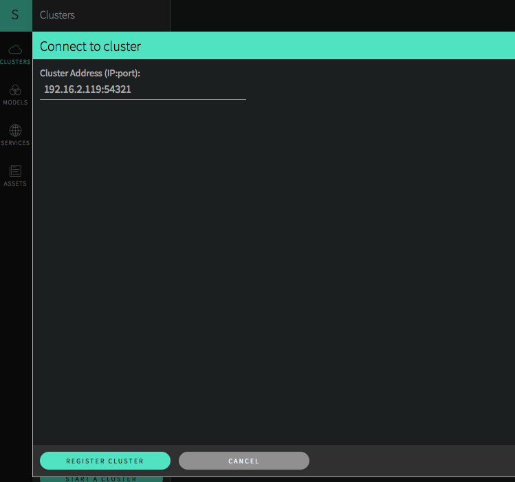
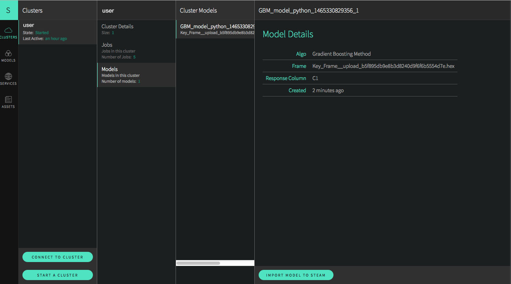
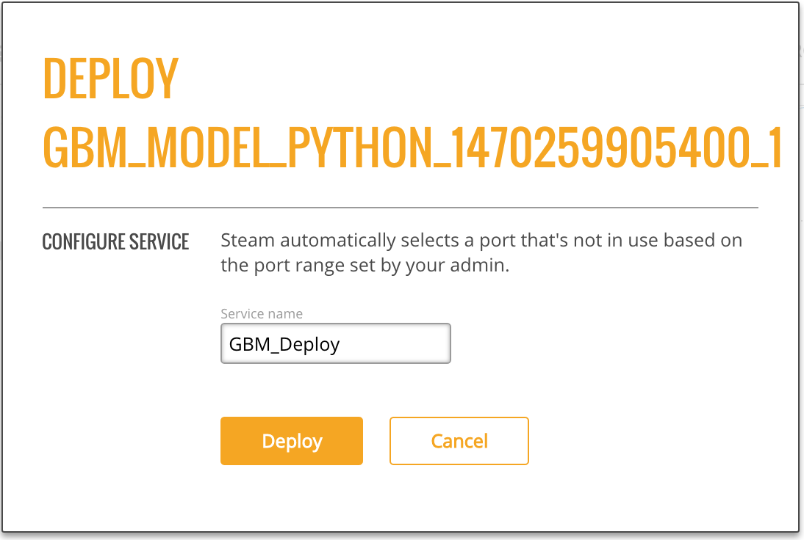

# Steam Standard Standalone Demo


This demo describes how to use Steam without the need for a local running instance of YARN. This demo will walk through the following procedures:

- Installing and starting Steam, the Compilation Service, and H2O
- Building a simple model in Python (Optional for users who don't have an existing demo)
- Deploying the model using Steam

During this demo, three terminal windows will remain open for the Steam, Scoring, and H2O services. A fourth terminal window will be used to run H2O commands in a Python example. 

Finally, these steps were created using H2O version 3.8.2.8, and that version resides in a Downloads folder. Wherever used, this version number and path should be adjusted to match your version and path.

## Requirements

- Web browser with an Internet connection
- s3cmd
	- available from <a href="http://s3tools.org/s3cmd" target="_blank">s3tools.org</a>
	- Requires AWS credentials. Contact your internal support for access.
	- Requires <a href="http://brew.sh/" target="_blank">Homebrew</a> to install to run the s3 commands:
	
	```
		brew install s3cmd
		s3cmd --configure
	```
- JDK 1.7 or greater
- Steam binary for Linux or OS X 
	- `s3cmd get s3://steam-release/steamY-master-linux-amd64.tar.gz`
	- `s3cmd get s3://steam-release/steamY-master-darwin-amd64.tar.gz`
- H2O jar file
	- available from the <a href="http://h2o-release.s3.amazonaws.com/h2o/rel-turchin/8/index.html" target="_blank">H2O Download</a> page

###Optional

The following are required if you use the Python demo included in this document. 

- A dataset that will be used to generate a model. This demo uses the well-known iris.csv dataset with headers (available online), and the dataset is saved onto the desktop. 
- Python 2.7

## Installing and Starting Steam, the Compilation Service, and H2O

1. Open a terminal window and download the steamY binary. Note that the command below downloads the OS X binary. Replace `darwin` with `linux` in the steps that follow to build on Linux.

	`user$ s3cmd get s3://steam-release/steamY-master-darwin-amd64.tar.gz`

2. Untar the steamY binary.

	`user$ tar xvf steamY-master-darwin-amd64.tar.gz`

3. Change directories to your Steam directory, and start the Jetty server.

		user$ cd steam-master-darwin-amd64
		user$ java -jar var/master/assets/jetty-runner.jar var/master/assets/ROOT.war
		
	>***Note***: The Jetty server defaults to port 8080. You can optionally provide a `--port` value for **jetty-runner.jar**.
		
4. Open another terminal window. Navigate to the Steam folder and start the Steam compilation service and scoring service.

		user$ cd steam-master-darwin-amd64/
		user$ ./steam serve master

	>***Note***: This starts the Steam web service on `localhost:9000`, the compilation service on `localhost:8080` (same as the Jetty server), and the scoring service on `localhost`. You can change these using `--compilation-service-address=<ip_address:port>` and `--scoring-service-address=<ip_address>`. Use `./steam help serve master` or `./steam serve master -h` to view additional options.

5. Open another terminal window. Navigate to the folder with your H2O jar file and start H2O. This will create a one-node cluster on your local machine.

		user$ cd ~/Downloads/h2o-3.8.2.8
		user$ java -jar h2o.jar 
		
6. Point your browser to the Steam URL, for example, http://localhost:9000/.
 
7. In the left pane, select the **Clusters** tab, then click the **Connect To Cluster** button to setup Steam with H2O. Specify the IP address and port of the cluster currently running H2O (for example, localhost:54321), then click **Register Cluster**. 

	

You are now ready to build a model on this cluster in Python. 

>***Note***: After you connect to a cluster, click on **Cluster Details**, select your cluster, then click the **Address** link on that page to launch H2O Flow. 

## Building a Model in Python (Optional)

>**Note**: This section can be skipped if you already have demo steps that you use in R, Python, or Flow. If you use another demo, be sure that you initialize H2O on your local cluster so that the data will be available in Steam.

The steps below show how to build model using the Iris dataset and the GBM algorithm. The steps will be run using H2O in Python. Once created, the model can be deployed in Steam. 


1. Open a terminal window. Change directories to the H2O folder, and start Python. Import the modules that will be used for this demo. 

		$ cd ~/Downloads/h2o-3.8.2.8
		$ python
		>>> import h2o
		>>> from h2o.estimators.gbm import H2OGradientBoostingEstimator

2. Initialize H2O using localhost and port 54321. (Note that if started Steam on a different machine, then replace `localhost` with the IP address of that machine.)

		>>> h2o.init(ip="localhost", port=54321)
		------------------------------  -------------------------------------
		H2O cluster uptime:             2 minutes 37 seconds 168 milliseconds
		H2O cluster version:            3.8.2.8
		H2O cluster name:               user
		H2O cluster total nodes:        1
		H2O cluster total free memory:  3.35 GB
		H2O cluster total cores:        8
		H2O cluster allowed cores:      8
		H2O cluster healthy:            True
		H2O Connection ip:              127.0.0.1
		H2O Connection port:            54321
		H2O Connection proxy:
		Python Version:                 2.7.9
		------------------------------  -------------------------------------

3. Upload the Iris dataset. Note that in this example, Python is running from the Downloads folder, and the Iris dataset is on the Desktop:

		>>> df=h2o.upload_file("../../Desktop/iris.csv")

4. Specify the configuration options to use when building a GBM model.

		>>> gbm_regressor = H2OGradientBoostingEstimator(distribution="gaussian", ntrees=10, max_depth=3, min_rows=2, learn_rate="0.2")

5. Train the model using the Iris dataset (`df` object) and the GBM configuration options. 

		>>> gbm_regressor.train(x=range(1, df.ncol), y=0, training_frame=df)

6. Optionally view the model details.

		>>> gbm_regressor

Once created, the model will be visible in the Steam UI. 

## Deploying a Model in Steam

1. In the Steam UI, Select **Cluster** > **Models**. Select a model from your demo, and then click **Import Model to Steam**. This pulls the model into Steam. Once imported, the model can then be deployed to the scoring service.

  

2. Select the **Models** tab in the left pane. You should see the model that you just imported. Select this model, and then click **Deploy This Model** to create scoring services for the model.
 

	

3. Specify the port number for the scoring service (defaults to 8000), then click **Deploy**.

4. Select the **Services** tab in the left pane.

5. Select a service (in this case, the model you just deployed), and click the link in the **Endpoint** field to reach the scoring service.

	

6. Make predictions using one of the following methods:
    
    - Specify input values based on column data from the original dataset
    
     OR
    
    - Enter a query string using the format `field1=value1&field2=value2` (for example, `sepal_width=3&petal_len=5`)

 Use the **Clear** button to clear all entries and begin a new prediction.
     
 You can view additional statistics about the scoring service by clicking the **More Stats** button.
