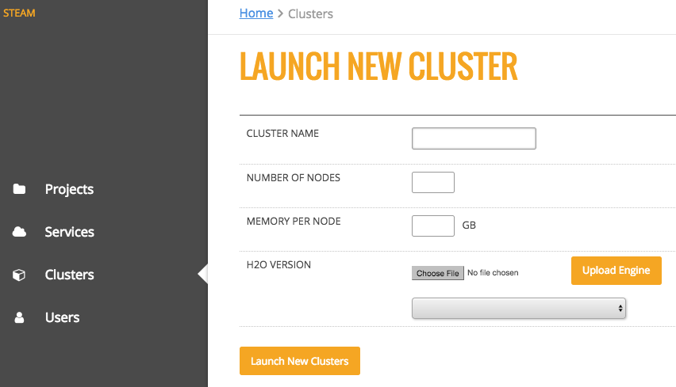

Clusters
========

The **Clusters** page shows all H2O clusters that Steam is connected to along with the status of the cluster. From this page, you can click the link to access H2O Flow (see next section), launch a new cluster, or delete a cluster.

.. figure:: images/cluster_page.png
   :alt: Steam Clusters page

Launch a New Cluster
--------------------

You can connect to additional clusters that are running H2O by clicking the **Launch New Cluster** button.

1. On the Launch New Cluster form, enter the following information:

 - Cluster Name
 - Number of Nodes
 - Memory per Node (in MB or GB)
 - H2O version (specifying a jar file)

2. Click **Launch New Clusters** when you are done. 
