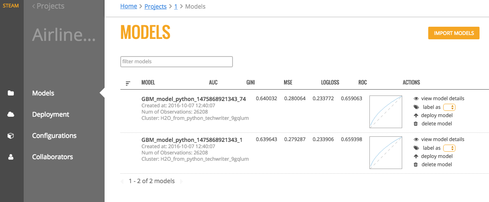
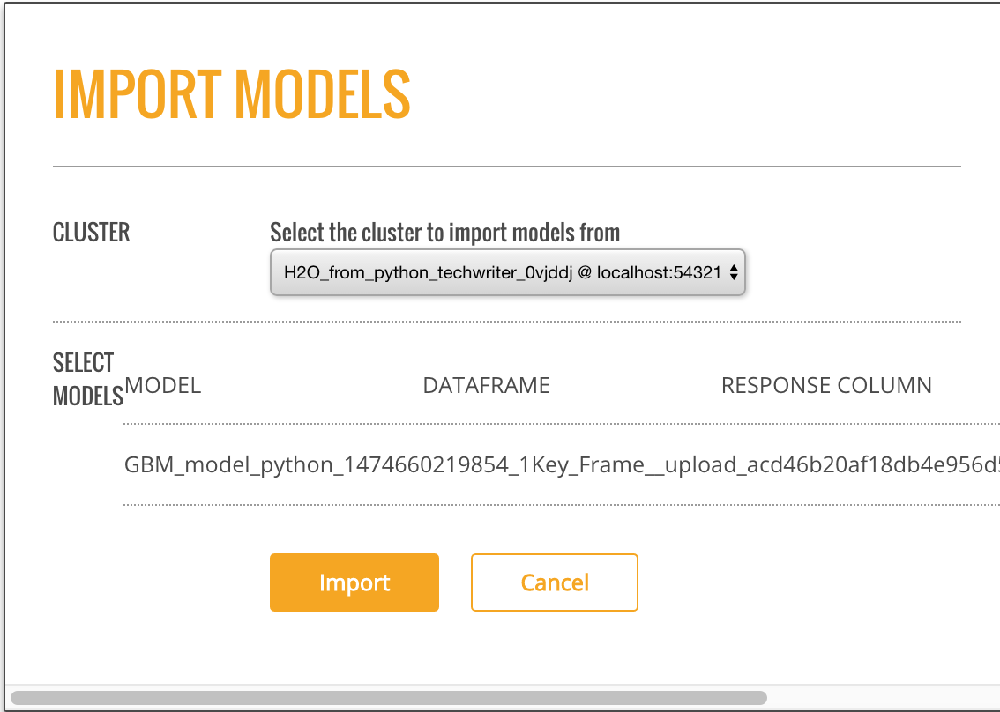
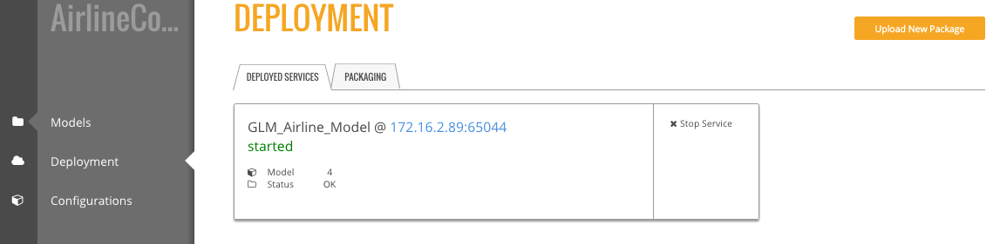
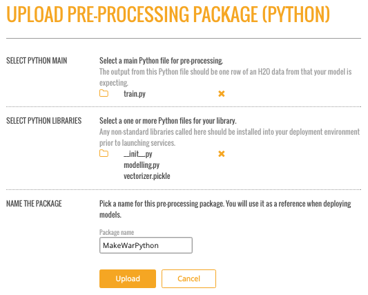

Projects
========

Steam makes use of project-based machine learning. Whether you are trying to detect fraud or predict user retention, the datasets, models, and test results are stored and saved in the individual projects. All Steam users within your environment can access these projects and the files within them.

The Steam Projects page includes additional subnavigation items for Models, Deployment, Configuration, and Collaborators. Each of these pages is described in later sections. 

Creating a Project
------------------

Before you can create a project, be sure that H2O is running on an available cluster.

1. To start a new project, click the **Start A New Project** button on the Welcome page.
2. When you first log in to Steam, the list of clusters will be empty. Enter the IP address of the cluster that is running H2O, then click **Connect**. 
3. Once connected, the current list of clusters will immediately populate with the cluster's information. Click **Connect** beside this cluster to continue.

 .. figure:: images/connect_to_cluster.png
   :alt: Connect to a cluster

4. Select an available H2O frame from the Datasets dropdown, then select
   the Model Category. Note that these dropdowns are automatically populated
   with information from datasets that are available on the selected
   cluster. If no datasets are available, then the dropdown lists will be
   empty. For clusters that contain datasets, after a dataset is
   selected, a list of corresponding model will display.
5. Select the checkbox beside the model(s) to import into the Steam
   project. 
6. Specify a name for the project.

 .. figure:: images/create_project.png
   :alt: Create a Project

   Create a project

7. Click **Create Project** when you are done. Upon successful completion, the **Models** page will be populated with the model(s) that you added to your project, and the new project will be available on the **Projects** page. On the **Projects** page, click on the newly created project. This opens a submenu allowing you to view the imported models, deployed models, and configurations specific to that project. Information about these topics is available in the sections that follow.

 .. figure:: images/models_page.png
   :alt: Models page

   Models page

Models
------

The **Models** page shows a list of all models included in a selected
Project. This list also includes summary information for each model.
This information varies based on whether the model is binomial or
regresssion.

For binomial models, the following values will display on the Models
page.

-  AUC
-  Gini
-  MSE
-  Logloss
-  ROC

For regression models, the following values will display on the Models
page.

-  MRD
-  MSE
-  R^2

   Models page

You can perform the following actions directly from this page:

-  Import a new model
-  View model details and export the model as a java, jar, or war file
-  Label a model (Refer to `Configurations`_ for information on how to create labels.)
-  Deploy the model

    **Note**: The Models page lists models in alphabetical order and
    shows up to five models per page. If your project includes more than five
    models, use the forward and back arrows at the bottom of the page to
    view more models.

Importing Models
~~~~~~~~~~~~~~~~

After models are added to an H2O cluster, they can be imported into an
existing Steam project. In the upper-right corner of the Models page,
click the **Import Models** button. This opens an Import Models popup
form.

The Cluster dropdown automatically populates with a list H2O clusters.
Specify the H2O cluster that has the models you want to import, then
select the additional model or models that you want to add to the
project.

   Import Models

Click **Import** when you are done. The newly added models will then
appear on the Models page.

Viewing Model Details
~~~~~~~~~~~~~~~~~~~~~

On the **Models** page, click the **view model details** link under the
Action column for the model that you want to view.

.. figure:: images/model_details.png
   :alt: Model Details page

   Model Details page

This page provides information about when the model was created, the
algorithm and dataset used to create the model, and the response column
specified when the model was built. The Goodness of Fit section provides
value information for the model, including the Mean Squared Error,
LogLoss, R^2, AUC, and Gini score. An ROC curve is available for
binomial models.

From this page, you can perform the following actions:

-  `Comparing Models`_
-  `Deploying a Model`_
-  `Exporting a Model`_

Comparing Models
^^^^^^^^^^^^^^^^

1. While viewing model details, click the **Compared To** field. This
   opens a popup showing all models available in the current project.

.. figure:: images/select_model.png
   :alt: Select model to compare

   Select model to compare

2. Select to compare the current model with any available model. This
   exampel compares a GLM model with a GBM model. Once a model is
   selected, the Model Details page immediately populates with the
   comparison information. The current model values are displayed in
   blue, and the selected comparison model displays in orange.

 .. figure:: images/model_compare.png
    :alt: Model Comparison

    Model Comparison

Deploying a Model
^^^^^^^^^^^^^^^^^

After comparing models, you might decide to deploy one or more of the
best models. Perform the steps below to deploy a model.

1. While viewing the model details, click the **Deploy Model** button.
   (Note that this can also be done directly from the **Models** page by
   selecting the **deploy model** link in the Action column.)
2. Specify a service name for the deployment.
3. To perform pre-processing on the model, specify a Preprocessing
   Script. Note that this dropdown is populated with scripts that are
   added to the project. Information about adding preprocessing scripts
   is available in the `Deployment`_ section.
4. Click **Deploy** when you are done.

 .. figure:: images/deploy_model.png
    :alt: Deploy Model

    Deploy Model

5. Upon successful completion, a scoring service will be created for this deployed model. Click the **Deployment** menu option on the left navigation to go to the Deployment page. Refer to the `Deployment`_ section for more information.

 .. figure:: images/deployment_page.png
    :alt: Deployment page
 
    Deployment page

Exporting a Model
^^^^^^^^^^^^^^^^^

Steam allows you to export models to your local machine.

1. While viewing the model details, click the **Export Model** button.
2. Specify whether to export the model as a .java, .jar, or .war file.
3. To perform pre-processing on the model during the export, specify a
   Preprocessing Script. Note that this dropdown is populated with
   scripts that are added to the project. Information about adding
   preprocessing scripts is available in the `Deployment`_ section.
4. Click **Download** when you are done.

.. figure:: images/export_model.png
   :alt: Deploy Model

Deployment
----------

The **Deployment** page lists all available deployed services. For each
deployed service, this page shows the model name, model ID, and the
status. You can stop a running service by clicking the **Stop Service**
button.

   Deployed Services

In addition to showing deployed services, a Packaging tab is available
showing the preprocessing packages used in the deployment.

.. figure:: images/packaging_tab.png
   :alt: Packaging Tab

   Packaging Tab

Uploading a New Package
~~~~~~~~~~~~~~~~~~~~~~~

Preprocessing packages can be used to perform additional data munging on
an existing model.

1. To upload a new preprocessing package, click the **Upload New
   Package** button in the upper-right corner of the Deployment page.
2. Specify the main Python file that will be used for preprocessing.
   Click on the folder link to browse for this file.
3. Specify additional files that may be dependencies of the main Python
   preprocessing file.
4. Enter a name for this new package.
5. Click **Upload** when you are finished.

Upon successful completion, the new preprocessing package will display
on the Packages tab of the Deployment page. This file can then be
specified when deploying or exporting models. (Refer to `Deploying a
Model`_ or `Exporting a Model`_.)

   Upload Package

Making Predictions
~~~~~~~~~~~~~~~~~~

1. To reach the Steam Prediction Service, click the IP address link
   listed under the Deployed Services for the deployed model that you
   want to score. This opens Steam Prediction Service tool. The fields
   that display on the Prediction Service tool are automatically
   populated with field information from the deployed model.

 .. figure:: images/prediction_service.png
   :alt: Prediction Services tool

   Prediction Services tool

2. Make predictions by specifying input values based on column data from
   the original dataset. This automatically populates the fields in the
   query string. (Note that you can optionally include input parameters
   directly in the query string instead of specifying parameters.)

3. Click **Predict** when you are done.

**Note**: Use the **Clear** button to clear all entries and begin a new prediction. Use the **More Stats** button to view additional statistics about the scoring service results.

Configurations
--------------

When maintaining and storing models in Steam, it is useful to know whether the version of a model that you're viewing is used for testing, development, production, etc. Steam allows admins/superusers to set labels (or versioning) for models and to apply permissions for those models using the labels. The Steam admin/superuser is responsible for creating new Steam users and setting roles and workgroups for those users. When setting Steam project configurations, labels can be created that allow, for example, only users in a Production workgroup to label a model as a Deployment model.

When a label is applied to a model, the Project Configurations page will show all models associated with a label.

.. figure :: images/model_labels.png
   :alt: Project Configurations page
   
   Project Configurations page

Creating a New Label
~~~~~~~~~~~~~~~~~~~~

1. On the Configurations page, click the **Create New Label** button.
2. Enter a unique name for the label, then provide a description.
3. Click **Save** when you are done.

 .. figure:: images/create_label.png
   :alt: Create a Label

   Create a Label

Upon successful completion, the new label will display on the Project
Configurations page and can be edited or deleted. This label will also
be available on the Models page in the **label as** dropdown. The
following image shows two labels in the **label as** dropdown: deploy
and test.

.. figure:: images/label_as.png
  :alt: Label as

  "Label as" options

Collaborators
-------------

The Collaborators page shows the users who have been added to the Steam database as well as the Labels Access (permissions) assigned to each user. Currently, users can only be added by the Steam superuser using the CLI.

.. figure:: images/collaborators.png
   :alt: Collaborators page

