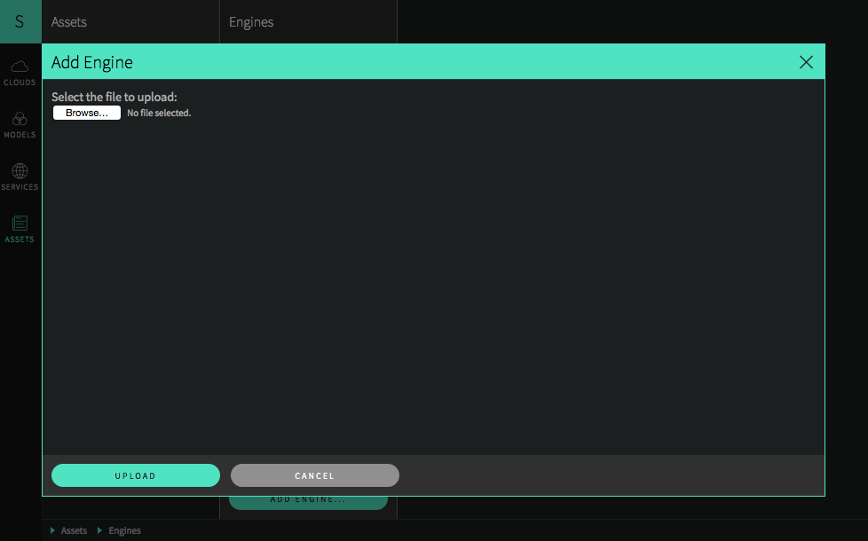
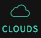
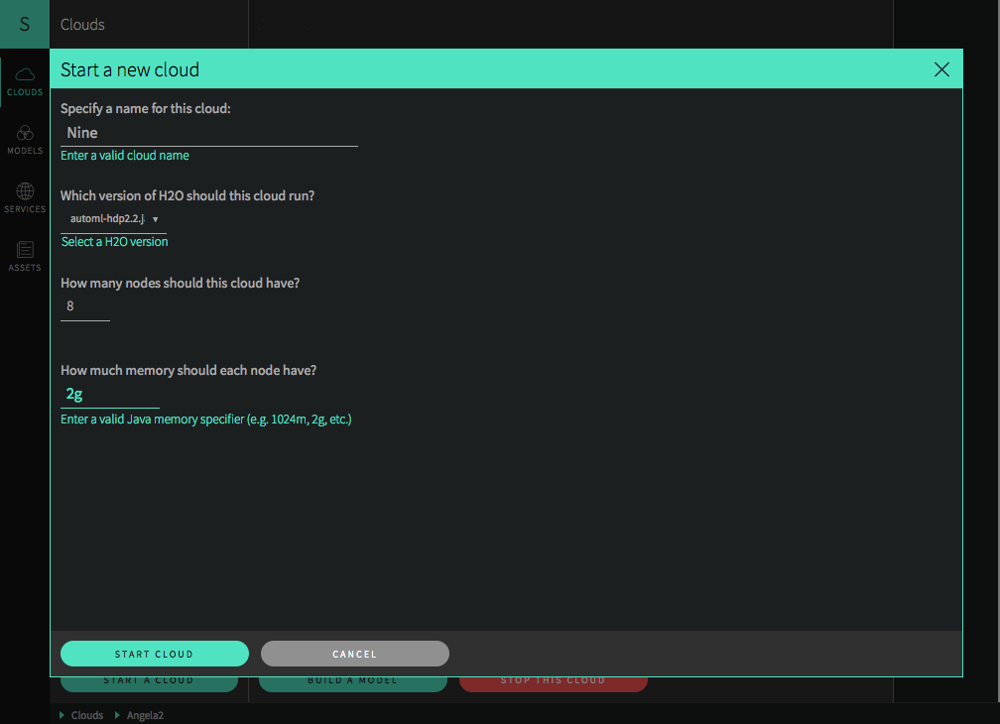
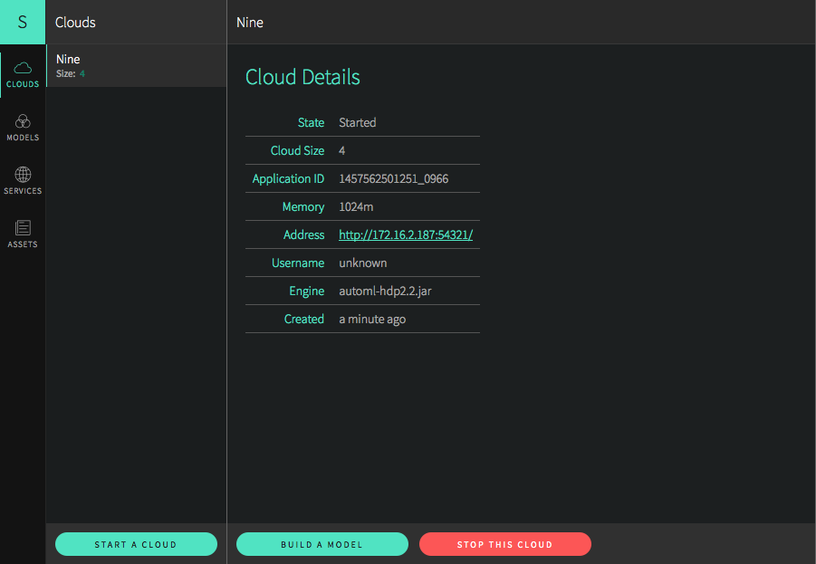
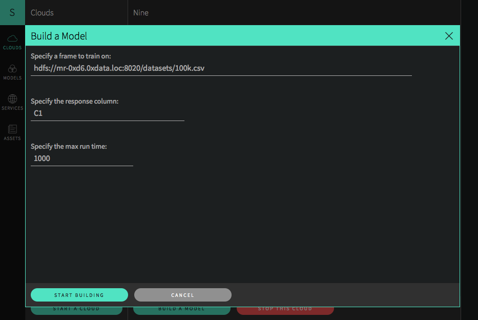
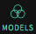

# Installing, Starting, and H2O Using Steam

This document is provided for external users and describes how to install, start, and use Steam on a YARN cluster. For instructions on using Steam on your local machine, refer to the **standard\_demo\_standalone** document.

## Requirements

- Web browser with an Internet connection
- Steam tar for OS X or Linux
- JDK 1.7 or greater
- H2O AutoML package (for example, **automl-hdp2.2.jar**)

## Installation
Perform the following steps to install Steam.

***Note***: This installation should only be performed on a YARN edge node.

1. Open a terminal window and SSH into your YARN edge node. 

		ssh <user>@<yarn_edge_node>

2. Retrieve the Steam release for your OS.

	**Linux**
	
		s3cmd get s3://steam-release/steamY-master-linux-amd64.tar.gz 
		
	**OS X**

		s3cmd get s3://steam-release/steamY-master-darwin-amd64.tar.gz		

	***Note***: This saves the Steam package (tar file) into your current folder.

3. Untar the Steam package. 

	**Linux**
	
		tar -xvf steamY-master-linux-amd64.tar.gz
	   
	**OS X**
	
		tar -xvf steamY-master-darwin-amd64.tar.gz

## Starting Steam
Now that Steam is installed, perform the following steps to start and use Steam. Note that two terminal windows will remain open: one for the Jetty server and one for Steam.

1. Change directories to your Steam directory, then set up the Jetty server using one of the following methods:

	**Linux**
		
		cd steam-master-linux-amd64
		java -jar var/master/assets/jetty-runner.jar var/master/assets/ROOT.war
		
	**OS X**
	
		cd steam-master-darwin-amd64
		java -jar var/master/assets/jetty-runner.jar var/master/assets/ROOT.war

	**Note**: The Jetty server defaults to port 8080. You can optionally provide a `--port` value for jetty-runner.jar.

2. Open another terminal window and ssh to the machine running YARN.

		ssh <user>@<yarn_edge_node>

3. Change directories to the Steam directory (either **steam-master-linux-amd64** or **steam-master-darwin-amd64**), then start Steam on the master server (the compilation server that will run the POJOs). For example, the following commands will start Steam on localhost. Note that the port value must match the port running the Jetty server, which defaults to 8080. 

		./steam serve master --compilation-service-address="localhost:8080"
		
	**Note**: You can view all available options for starting Steam using `./steam help serve master`

	You will see a message similar to the following when Steam starts successfully.

		2016/04/28 13:34:56 steam v build 2016-04-28T20:15:00+0000
		2016/04/28 13:34:56 Working directory: /home/seb/steam--linux-amd64/var/master
		2016/04/28 13:34:56 WWW root: /home/seb/steam--linux-amd64/var/master/www
		2016/04/28 13:34:57 Priming datastore for first time use...
		2016/04/28 13:34:57 Datastore location: /home/seb/steam--linux-amd64/var/master/db/steam.db
		2016/04/28 13:34:57 Web server listening at 192.16.2.182:9000
		2016/04/28 13:34:57 Point your web browser to http://192.16.2.182:9000/

## Using Steam

In a Web browser, navigate to the Steam Web server (for example, http://192.16.2.182:9000).

### Adding an Engine
An empty Steam UI will display. Before performing any tasks, you must first add an Asset. In this case, the **automl-hdp2.2.jar** file (or similar) provides the engine necessary for Steam to run AutoML jobs. 

1. Click the **Assets** icon () on the left navigation panel, then select **Add Engine**. 

	

2. Browse to the **automl-hdp2.2.jar** file on your local machine, then click **Upload**. 

### Starting a Cloud

Clouds can be configured after the engine asset was successfully added. 

1.  Click the **Clouds** icon () on the left navigation panel, then select **Start a Cloud**. 

2. Enter/specify the following information to set up your cloud:

	a. A name for the cloud

	b. The version of H2O that will run on the cloud.

	c. The number of nodes on the cloud.
	
	d. The amount of memory available on each node. Be sure to include the unit ("m" or "g").
	
	
	
3. Click **Start Cloud** when you are finished.

The Cloud Details page opens upon successful completion. This page shows the cloud configuration information and includes a link to the H2O Flow URL. From this page, you can begin building your model. 

  

***Note***: You can view a stream of the cloud creation log in the terminal window that is running Steam. In the UI, Steam will respond with an error if the cloud configuration is incorrect (for example, if you specify more nodes than available on the cluster). 

### Adding a Model
Models are created from the Cloud Details page. When building a model, you will need to provide the location of the dataset that you will use as well as the response column. 

1. Click the **Build a Model** button on the bottom of the Cloud Details page.

2. Enter a path for the dataset that you want to use to build the model. 

	***Note***: If you choose to use a local dataset, then that dataset must reside in the same folder/path on each node in the cluster.

3. Specify the column that will be used as the response column in the model. 

4. Specify the maximum run time in seconds. H2O will return an error if the model build stalls after this threshold is reached.

5. Click **Start Building** when you are finished. 

	

### Viewing Models	

Click the **Models** icon () on the left navigation panel to view models that were successfully created. 

These models are processed using H2O's AutoML algorithm, which determines the best method to use to build the model. The model name includes this method. So, for example, if Steam returns a model named "DRF_model...", then this indicates that DRF was the algorithm that provided the best result.

### Deploying Models

After a model is built, the next step is to deploy the model in order to make/view predictions.

1. Click the **Models** icon () on the left navigation panel.

2. Select the model that you want to use, then click the **Deploy this Model** button on the bottom of the page.

3. Specify the port to use for the scoring service. 

	***Note***: Steam will return an error if you specify a port that is already being used.

4. Click **Deploy** when you are done.

### Making Predictions

Successfully deployed models can be viewed on the **Services** page. On this page, click the Endpoint link to launch the H2O Prediction Services UI. From this page, you can make predictions using one of the following methods:

   - Specify input values based on column data from the original dataset
    
     OR
    
   - Enter a query string using the format `field1=value1&field2=value2` (for example, `sepal_width=3&petal_len=5`)

Use the **Clear** button to clear all entries and begin a new prediction.
     
You can view additional statistics about the scoring service by clicking the **More Stats** button.

## Using Steam with H2O Flow

As with other H2O products, Flow can be used alongside Steam when performing machine learning tasks.

On the Cloud Details page, click the **Address** link to open H2O Flow in a new tab. 

   

***Note***: Refer to the H2O Flow documentation for information on how to use Flow. 

## Stopping Steam	

When you are finished, use the following process to safely shut down Steam:

1. On the Services page, stop all running services.

2. Stop all running clouds.
