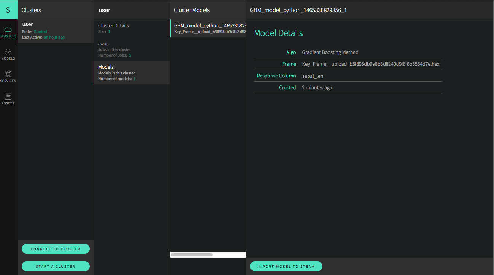
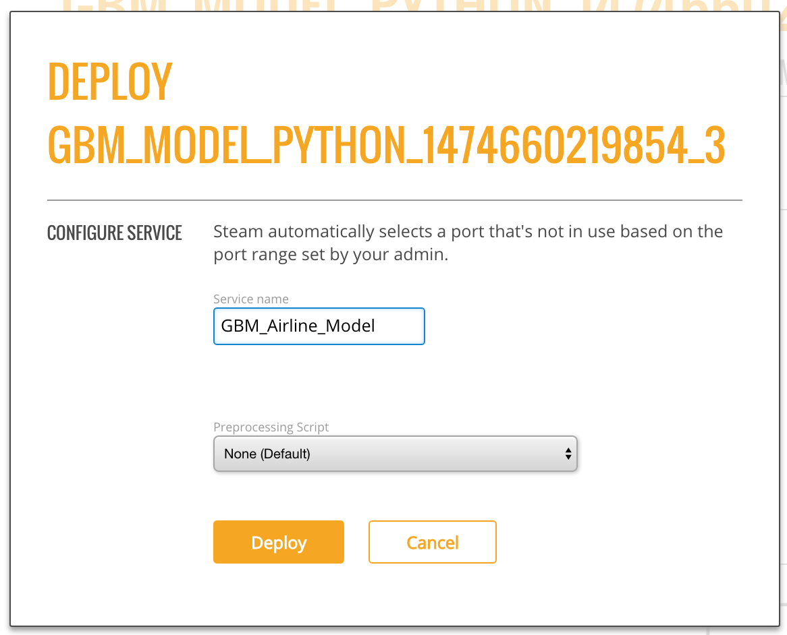
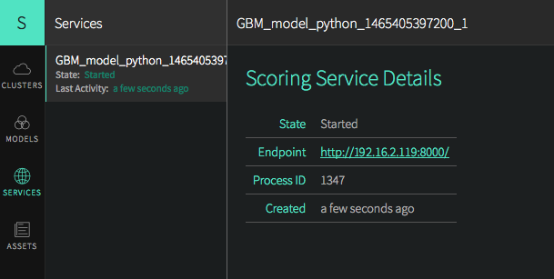

# Steam Standalone Installation

This document describes how to use Steam without the need for a local running instance of YARN. These instructions will walk through the following procedures:

- Installing and starting Steam, the Compilation Service, and H2O
- Adding Roles, Workgroups, and Users to the database
- Building a simple model in Python (Optional for users who don't have an existing demo.)
- Deploying the model using Steam

During this demo, three terminal windows will remain open for the Steam, Scoring, and H2O services. A fourth terminal window will be used to run H2O commands in the Python or R example. 

Finally, these steps were created using H2O version 3.8.2.8, and that version resides in a Downloads folder. Wherever used, this version number and path should be adjusted to match your version and path.

## Requirements

- Web browser with an Internet connection
- JDK 1.7 or greater
- PostgreSQL 9.1 or greater
	- available from <a href="https://www.postgresql.org/" target="_blank">PostgreSQL.org</a>
- Steam tar for Linux or OS X 
	- available from <a href="http://www.h2o.ai/steam/">h2o.ai/steam/</a>
- H2O jar file
	- available from the <a href="http://www.h2o.ai/download/h2o/choose" target="_blank">H2O Download</a> page

###Optional

The following are required if you use a Python or R demo.

**Python**

- A dataset that will be used to generate a model. This demo uses the well-known iris.csv dataset with headers (available online), and the dataset is saved onto the desktop. 
- Python 2.7

**R**

- A dataset that will be used to generate a model. 
- Comprehensive R Archive Network (R). Available from <a href="https://cran.r-project.org/mirrors.html", target="_blank">https://cran.r-project.org/mirrors.html</a>. 

## Starting Steam

This section describes how to set up and start Steam and start the Steam CLI for user management. Five terminal windows will be open the first time you run this setup; four terminal windows will be open for subsequent logins.

1. Go to <a href="http://www.h2o.ai/steam/">h2o.ai/steam/</a> and download the Steam version for your platform (Linux or Mac). Be sure to accept the EULA.

2. Open a terminal window and untar the steamY binary. Note that the command below untars the OS X binary. Replace `darwin` with `linux` in the steps that follow to build on Linux.

	`user$ tar xvf steamY-master-darwin-amd64.tar.gz`

3. Open a second terminal window and start PostgreSQL. This should be started from the folder where PostgreSQL was installed.

		postgres -D /usr/local/var/postgres

4. Open a third terminal window to create a new user for the Steam database and then create the database. The commands below only need to be performed once. The example below creates a steam **superuser** with a password ``superuser`` before creating the Steam database. Be sure to provide a secure password, and be sure to remember the password that you enter. This will be required each time you log in to Steam. 

		createuser -P steam 
		Enter password for new role: superuser
		Enter it again: superuser
		# Change directories to the Steam /var/master/scripts folder.
		cd steam-master-darwin-amd64/var/master/scripts
		./create-database.sh

5. Change directories to your Steam directory, and start the Jetty server.

		user$ cd steam-master-darwin-amd64
		user$ java -jar var/master/assets/jetty-runner.jar var/master/assets/ROOT.war
		
	>***Note***: The Jetty server defaults to port 8080. You can optionally provide a `--port` value for **jetty-runner.jar**.
		
6. Open a fourth terminal window. From within the **steam-maseter-darwin-amd64** folder, start the Steam compilation and scoring service using the password that you provided in Step 2. This starts Steam on localhost:9000.

		./steam serve master --superuser-name=superuser --superuser-password=superuser

	>***Note***: This starts the Steam web service on `localhost:9000`, the compilation service on `localhost:8080` (same as the Jetty server), and the scoring service on `localhost`. You can change these using `--compilation-service-address=<ip_address:port>` and `--scoring-service-address=<ip_address>`. Use `./steam help serve master` or `./steam serve master -h` to view additional options.

7. Open a fifth terminal window. From within the Steam folder, log in to the machine running Steam (localhost:9000). Use the password that you provided in Step 2.

		./steam login localhost:9000 --username=superuser --password=superuser

8. Run the following to verify that the CLI is working correctly.

		./steam help
		
At this point, you can open a browser and navigate to localhost:9000. Note that you may be prompted to once more provide the login credentials supplied in Step 7. 

The next section describes how to add additional users to the Steam database. 

### Adding Roles, Workgroups, and Users

The following example creates sample roles, workgroups, and users using the CLI. Refer to the [CLI Command Reference Appendix](CLIAppendix.md) for information about all of the commands available in the CLI. These commands are run from the terminal window used to log in to Steam ([Step 7](#step7) above).

		# Create engineer role and link that role to permissions
		./steam create role engineer --desc="a default engineer role"
		./steam link role engineer ViewModel ViewProject ViewWorkgroup
		
		# Create data scientist role and link that role to permissions
		./steam create role datascience --desc="a default data scientist role"
		./steam link role datascience ManageProject ManageModel ViewCluster 
		
		# Create preparation and production workgroups
		./steam create workgroup preparation --desc="data prep group"
		./steam create workgroup production --desc="production group"
		
		# Create two users - Bob and Jim
		./steam create identity bob bobSpassword
		./steam create identity jim j1mSpassword
		
		# Link Bob to engineer role; link Jim to datascience role
		./steam link identity bob role engineer
		./steam link identity jim role datascience
		
		# Link Bob to preparation workgroup; link Jim to production workgroup
		./steam link identity bob workgroup preparation
		./steam link identity jim workgroup production

## Using H2O with Steam

Now that Steam is running and users are set up, this section describes how to use H2O with Steam. 

1. Open another terminal window. Navigate to the folder with your H2O jar file and start H2O. This will create a one-node cluster on your local machine on port 54321.

		user$ cd ~/Downloads/h2o-3.8.2.8
		user$ java -jar h2o.jar 
		
2. Point your browser to the Steam URL, for example, http://localhost:9000/.
 
3. In the left pane, select the **Clusters** tab (selected by default), then click the **Connect To Cluster** button to setup Steam with H2O. Specify the IP address and port of the cluster currently running H2O (for example, localhost:54321), then click **Register Cluster**. 

	

You are now ready to build a model on this cluster in Python. 

>***Note***: After you connect to a cluster, click on **Cluster Details**, select your cluster, then click the **Address** link on that page to launch H2O Flow. 

## Building a Model in Python (Optional)

>**Notes**: This section can be skipped if you already have demo steps that you use in R, Python, or Flow. If you use another demo, be sure that you initialize H2O on your local cluster so that the data will be available in Steam. 
 
 >	Additional demos for Python are available <a href="https://github.com/h2oai/h2o-3/tree/master/h2o-py/demos" target="_blank">here</a>.
 
 > Demos for R are available <a href="https://github.com/h2oai/h2o-3/tree/master/h2o-r/demos" target="_blank">here</a>. 
 
 > A demo of Flow can be viewed <a href="https://www.youtube.com/watch?feature=player_embedded&v=wzeuFfbW7WE" target="_blank">here</a>. 

The steps below show how to build model using the Iris dataset and the GBM algorithm. The steps will be run using H2O in Python. Once created, the model can be deployed in Steam. 

1. Open a terminal window. Change directories to the H2O folder, and start Python. Import the modules that will be used for this demo. 

		$ cd ~/Downloads/h2o-3.8.2.8
		$ python
		>>> import h2o
		>>> from h2o.estimators.gbm import H2OGradientBoostingEstimator

2. Initialize H2O using localhost and port 54321. (Note that if started Steam on a different machine, then replace `localhost` with the IP address of that machine.)

		>>> h2o.init(ip="localhost", port=54321)
		------------------------------  -------------------------------------
		H2O cluster uptime:             2 minutes 37 seconds 168 milliseconds
		H2O cluster version:            3.8.2.8
		H2O cluster name:               user
		H2O cluster total nodes:        1
		H2O cluster total free memory:  3.35 GB
		H2O cluster total cores:        8
		H2O cluster allowed cores:      8
		H2O cluster healthy:            True
		H2O Connection ip:              127.0.0.1
		H2O Connection port:            54321
		H2O Connection proxy:
		Python Version:                 2.7.9
		------------------------------  -------------------------------------

3. Upload the Iris dataset. Note that in this example, Python is running from the Downloads folder, and the Iris dataset is on the Desktop:

		>>> df=h2o.upload_file("../../Desktop/iris.csv")

4. Specify the configuration options to use when building a GBM model.

		>>> gbm_regressor = H2OGradientBoostingEstimator(distribution="gaussian", ntrees=10, max_depth=3, min_rows=2, learn_rate="0.2")

5. Train the model using the Iris dataset (`df` object) and the GBM configuration options. 

		>>> gbm_regressor.train(x=range(1, df.ncol), y=0, training_frame=df)

6. Optionally view the model details.

		>>> gbm_regressor

Once created, the model will be visible in the Steam UI. 

## Deploying a Model in Steam

1. In the Steam UI, Select **Cluster** > **Models**. Select a model from your demo, and then click **Import Model to Steam**. This pulls the model into Steam. Once imported, the model can then be deployed to the scoring service.

  

2. Select the **Models** tab in the left pane. You should see the model that you just imported. Select this model, and then click **Deploy This Model** to create scoring services for the model.
 

	

3. Specify the port number for the scoring service (defaults to 8000), then click **Deploy**.

4. Select the **Services** tab in the left pane.

5. Select a service (in this case, the model you just deployed), and click the link in the **Endpoint** field to reach the scoring service.

	

6. Make predictions using one of the following methods:
    
    - Specify input values based on column data from the original dataset
    
     OR
    
    - Enter a query string using the format `field1=value1&field2=value2` (for example, `sepal_width=3&petal_len=5`)

 Use the **Clear** button to clear all entries and begin a new prediction.
     
 You can view additional statistics about the scoring service by clicking the **More Stats** button.
 
Refer to the [H2O Scoring Service Builder](ScoringServiceBuilder.md) document for more information.

## Stopping the Steam Database

When you are finished using Steam, press Ctrl+C in each of the Steam, Compilation Service, and postgres terminal windows to stop the services end your session. 

## What's Next?
 
Now that you have completed your first demo, you are ready to begin creating models using your own data. Additional users can then be give access to this data based on the user's role and workgroup.  

