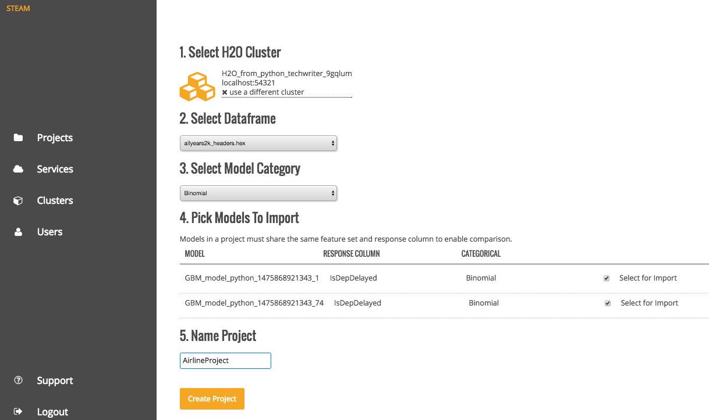
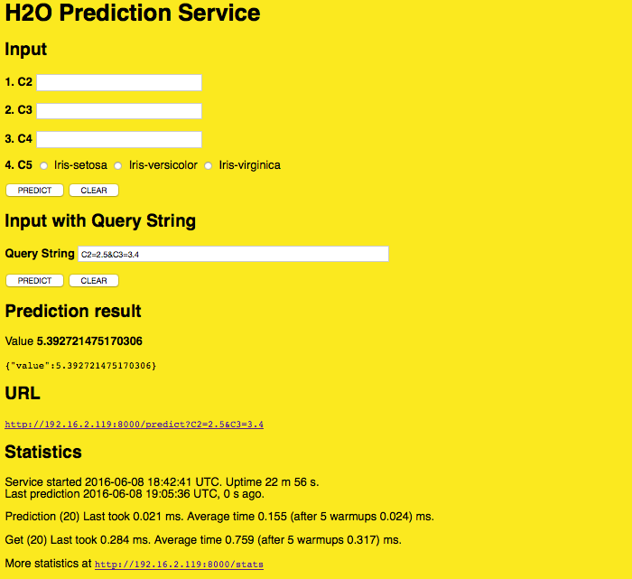

## Using Steam

In a Chrome web browser, navigate to the Steam web server using login credential provided by your admin and/or Steam superuser. This Steam web server is the server on which an admin has installed Steam (for example, http://192.16.2.182:9000). Contact your admin for the IP address and for credentials.

### <a name="createproject"></a>Creating a Project

Steam makes use of project-based machine learning. Whether you are trying to detect fraud or predict user retention, the datasets, models, and test results are stored and saved in the individual projects. And all Steam users within your environment have access to these projects. 

The first time you log in to Steam, an empty Steam page will display, prompting you to start a project. Be sure to accept the terms and conditions in order to continue.

 

1. Accept the terms of this preview release, then click **Start a New Project**. This opens a page allowing you to start a new project from scratch or to begin importing models into your Steam environment. 

 

2. To start a new project from scratch, click **Create New Project**. This opens a page showing you the available H2O clusters. When you first log in to Steam, the list of clusters will be empty. Enter your cluster IP address, then click **Connect**. Once connected, this will immediately populate the current list of clusters.
3. Select the H2O frame from the Datasets dropdown, then select the Category.
4. Select the checkbox beside the model(s) to import into the Steam project.
5. Specify a name for the project.

 

6. Click **Create Project** when you are done. Upon successful completion, the Models page will be populated with the model(s) that you added to your project.

 

You can perform the following actions directly from the models page:

- Import a new model
- View model details and export the model as a java, jar, or war file 
- Label a model as a test, staging, or production model
- Deploy the model (See next section.)

Following is an example of the Model Details page.


### <a name="deploymodel"></a>Deploying a Model in Steam

1. On the Models page, click the **deploy model** link for the model that you want to deploy.
2. Specify a service name for the deployment, then click **Deploy**.

 

3. Upon successful completion, a scoring service will be created for this deployed model. Click the **Deployment** menu option on the left navigation to go to the Deployment page.

 


### <a name="makepredictions"></a>Making Predictions

1. To reach the scoring service, click the IP address link listed under the Deployed Services. This opens Steam Prediction Service tool. The fields that display on the Prediction Service tool are automatically populated with field information from the deployed model.

 

2. Make predictions by specifying input values based on column data from the original dataset. This automatically populates the fields in the query string. (Note that you can optionally include input parameters directly in the query string instead of specifying parameters.)

3. Click **Predict** when you are done. 

>**Note**: Use the **Clear** button to clear all entries and begin a new prediction. Use the **More Stats** button to view additional statistics about the scoring service results.

## <a name="usesteamwithflow"></a>Using Steam with H2O Flow

As with other H2O products, Flow can be used alongside Steam when performing machine learning tasks.

Navigate to the Clusters page in Steam and click the link for the H2O cluster that you want to open. 

   

This opens H2O Flow in a new tab.

   

***Note***: Refer to the H2O Flow documentation for information on how to use Flow. 

## <a name="stopsteam"></a>Stopping Steam

When you are finished using Steam, press Ctrl+C in each of the Steam, Compilation Service, and postgres terminal windows to stop the services end your session. 

## <a name="startcli"></a>Starting the Steam CLI

The CLI is an optional utility that can be used to maintain a Steam environment and to create new roles, workgroups, and users. The CLI will primarily be used by admins and/or Steam superusers. The steps below describe how to start the Steam CLI. 

Perform the following steps to start the Steam CLI.

1. Open a terminal window and ssh to the machine running Steam. Be sure to provide the correct password for the node when prompted. 

 ```ssh <user>@<yarn_edge_node>```

1. Change directories to the Steam folder. From within this folder, log in to the machine running Steam. Use the password that you provided when you created superuser. The exmaple below logs in a user named **Bob**.

 ```cd steam-0```
 
 ```./steam login 192.168.2.182:8080 --username=bob --password=bobSpassword```

1. Run the following to verify that the CLI is working correctly.

		./steam help
		
Refer to the [CLI Appendix](CLIAppendix.md) for information on the commands available in the CLI.
