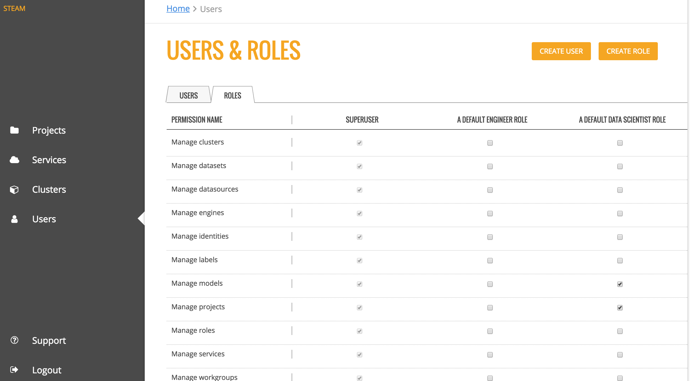

Users
=====

The Users page includes a list of all users are have been added to the Steam database along with the user's role. From this page, Steam superusers can add, edit, and deactivate users and roles. 

.. figure:: images/users.png
   :alt: Users page

   Users tab

The Roles tab provides a table of the permissions assigned to each role. The information in this table is viewable only to users with appropriate privileges. 

   Roles tab

Creating Roles
--------------

Roles must be created before users can be added to Steam. 

1. To create a new role, click on the **Create Role** button. 
2. Specify a name and description for the role, then select the permissions that will be granted to the role. 
3. Click **Create Role** at the bottom of the form when you are done.

   
   Create Role

Deleting Roles
--------------

On the Roles tab, scroll down to the bottom of the page, and click the trashcan icon beside the role that you want to delete. A confirmation page will display, prompting you to confirm the deletion. Click **Confirm** to remove the role.

   
   Delete Role

Adding Users
------------

Superusers can add users directly from within the UI. 

**Note**: Users must be assigned to a role. Because of that, roles must be created before new users can be added. 

1. Click the **Create User** button.
2. Enter the name of the user. Note that the name must match with a username in your YARN system.
3. Specify and confirm a password for the user. 
4. Specify the role(s) and workgroup(s) for this user. 
5. Click **Create User** when you are done.

   
   Create user

Upon successful completion, the new user will appear in the list of Steam users.

Editing Users
-------------

On the Users tab, click the **Edit** link beside the user you want to edit. This opens the Edit User Details form. Change the user's workgroup and/or roles, then click **Confirm** when you are done. 

   
   Edit user 

Deactivating/Reactivating Users
-------------------------------

On the Users tab, click the **Deactivate User** link beside the user whose Steam access you want to revoke. Click **Reactivate User** to once again grant access for that user. 

   
   Deactivate/reactivate user

Changing Permissions
--------------------

Superusers can add or remove permissions for each role directly on this page. Select the checkbox for the correspoding permission and role that you want to change, then click **Review Changes** at the bottom of the page. A popup displays, providing you with a summary of the changes.

   Confirm changes

Click the **Confirm** button beside each change that you want to make, then click **Save Changes** to complete the update.

.. figure:: images/update_permissions_save.png
   :alt: Save changes

   Save changes
