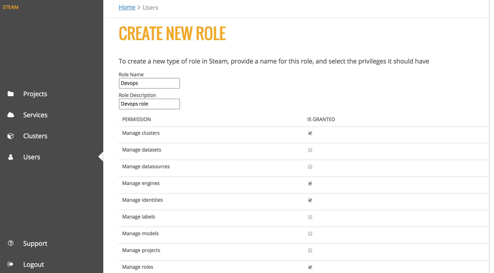
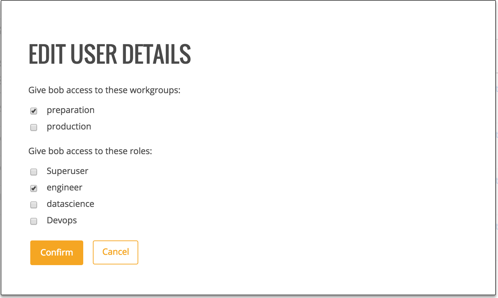
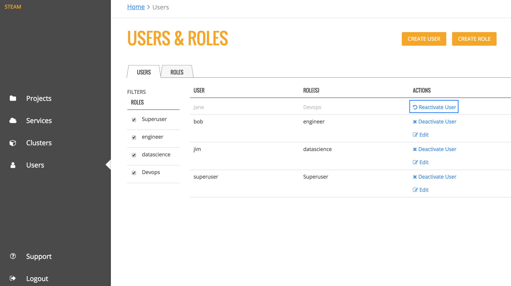

Configurations
==============

The Configurations page includes a list of all users are have been added to the Steam database along with the user's role. From this page, Steam Admins can add, edit, and deactivate users and roles.

**Note**: Only Admins have access to the **Configurations** page. 

.. figure:: images/users.png
   :alt: Users page

   Users tab

The Roles tab provides a table of the permissions assigned to each role. The information in this table is viewable only to users with appropriate privileges. 

.. figure:: images/roles_tab.png
   :alt: Roles tab

   Roles tab

The Authentication tab allows you to connect Steam to your current user database.

.. figure:: images/ldap_authentication_config.png
   :alt: Autnetication tab

   Authentication tab

The Kerberos ... tab allows you to ...

   Kerberos ... tab

Configure LDAP Connection Settings
----------------------------------

1. Navigate to the **Configurations** page and select the **Authentication** tab. 

2. Select LDAP in the **User DB Type** drop down menu, then configure the LDAP connection settings. (Refer to the table below and the image that follows.)

 +---------------------------+------------------------------+------------------------------------------+
 | Field                     | Description                  | Example                                  |
 +===========================+==============================+==========================================+
 | Host                      | The LDAP host server address | ldap.0xdata.loc                          |
 +---------------------------+------------------------------+------------------------------------------+
 | Port                      | The LDAP server port         | 389                                      |
 +---------------------------+------------------------------+------------------------------------------+
 | SSL-Enabled               | Enable this if your LDAP     |                                          |
 |                           | supports SSL.                |                                          |
 +---------------------------+------------------------------+------------------------------------------+
 | Bind DN                   | The Distinguished Name used  | cn=admin,dc=0xdata,dc=loc                |
 |                           | by the LDAP server if        |                                          |
 |                           | extended access is required. |                                          |
 |                           | This can be left blank if    |                                          |
 |                           | anonymous bind is sufficient.|                                          |
 +---------------------------+------------------------------+------------------------------------------+
 | Bind DN Password          | The password for the Bind DN | h2o                                      |
 |                           | user                         |                                          |
 +---------------------------+------------------------------+------------------------------------------+
 | User Base DN              | The location of the LDAP     | ou=users,dc=0xdata,dc=loc                |
 |                           | users, specified by the DN of|                                          |
 |                           | your user subtree            |                                          |
 +---------------------------+------------------------------+------------------------------------------+
 | User Base Filter          | The LDAP search filter used  | department=IT                            |
 |                           | to filter users              |                                          |
 +---------------------------+------------------------------+------------------------------------------+
 | User Name Attribute       | The User Attribute that      | uid                                      |
 |                           | contains the username        |                                          |
 +---------------------------+------------------------------+------------------------------------------+
 | Group DN                  | The Distinguished Name used  | cn=jettygroup,ou=groups,dc=0xdata,dc=loc |
 |                           | for group synch              |                                          |
 +---------------------------+------------------------------+------------------------------------------+
 | Static Member Attribute   | The attribute for static     | memberUid                                |
 |                           | group entries                |                                          |
 +---------------------------+------------------------------+------------------------------------------+
 | Search Request Size Limit | Limit the size of search     |                                          |
 |                           | results. 0 indicates         |                                          |
 |                           | unlimited.                   |                                          |
 +---------------------------+------------------------------+------------------------------------------+
 | Search Request Time Limit | Limit the time allotted for  | 0                                        |
 |                           | completing search results. 0 |                                          |
 |                           | indicates unlimited.         |                                          |
 +---------------------------+------------------------------+------------------------------------------+

 .. figure:: images/ldap_authentication_config.png
    :alt: LDAP Configuration
  
3. Click **Test Config** when you are done. A valid response message indicates that the configuration was successful.
4. Click **Save Config**.
5. In order for the configuration to take effect, you must log out and restart (or stop then start) Steam.

  ::
    
    sudo service steam restart

After LDAP is configured, users can log in to Steam using their LDAP username and password. 

Kerberos Authentication (Optional)
----------------------------------

1. Navigate to the **Configurations** page and select the **Kerberos** tab. 

Creating Roles
--------------

Roles must be created before users can be added to Steam. 

1. To create a new role, click on the **Create Role** button. 
2. Specify a name and description for the role, then select the permissions that will be granted to the role. 
3. Click **Create Role** at the bottom of the form when you are done.

   
   Create Role

Deleting Roles
--------------

On the Roles tab, scroll down to the bottom of the page, and click the trashcan icon beside the role that you want to delete. A confirmation page will display, prompting you to confirm the deletion. Click **Confirm** to remove the role.

.. figure:: images/delete_role.png
   :alt: Delete Role
   
   Delete Role

Adding Users
------------

Admins can add users directly from within the UI.

**Note**: Users must be assigned to a role. Because of that, roles must be created before new users can be added. 

1. Click the **Create User** button.
2. Enter the name of the user. Note that the name must match with a username in your YARN system.
3. Specify and confirm a password for the user. 
4. Specify the role(s) and workgroup(s) for this user. 
5. Click **Create User** when you are done.

.. figure:: images/create_user.png
   :alt: Create user
   
   Create user

Upon successful completion, the new user will appear in the list of Steam users.

Editing Users
-------------

On the Users tab, click the **Edit** link beside the user you want to edit. This opens the Edit User Details form. Change the user's workgroup and/or roles, then click **Confirm** when you are done. 

   
   Edit user 

Deactivating/Reactivating Users
-------------------------------

On the Users tab, click the **Deactivate User** link beside the user whose Steam access you want to revoke. Click **Reactivate User** to once again grant access for that user. 

   
   Deactivate/reactivate user

Changing Permissions
--------------------

Admins can add or remove permissions for each role directly on this page. Select the checkbox for the correspoding permission and role that you want to change, then click **Review Changes** at the bottom of the page. A popup displays, providing you with a summary of the changes.

.. figure:: images/update_permissions_confirm.png
   :alt: Confirm changes

   Confirm changes

Click the **Confirm** button beside each change that you want to make, then click **Save Changes** to complete the update.

.. figure:: images/update_permissions_save.png
   :alt: Save changes

   Save changes
