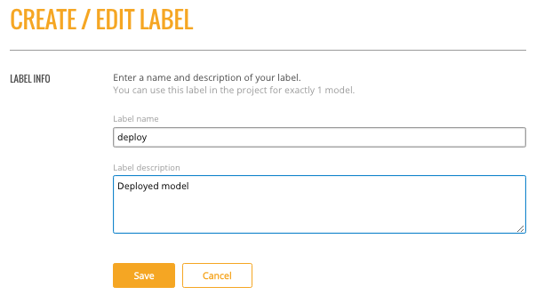

## Configurations

Steam allows you to set labels for models (such as Production, Test, etc.) and apply permissions for using the labels. The Steam admin/superuser is responsible for creating new Steam users and setting roles and workgroups for those users. When setting Steam project configurations, labels can be created that allow, for example, only users in a Production workgroup to label a model as a production model. 

When a label is applied to a model, the Project Configurations page will show all models associated with a label.

## Creating a New Label

1. On the Configurations page, click the **Create New Label** button.
2. Enter a unique name for the label, the provide a description.
3. Click **Save** when you are done.

Upon successful completion, the new label will display on the Project Configurations page and can be edited or deleted. This label will also be available on the Models page in the **label as** dropdown. The following image shows two labels in the **label as** dropdown: deploy and test.

 

