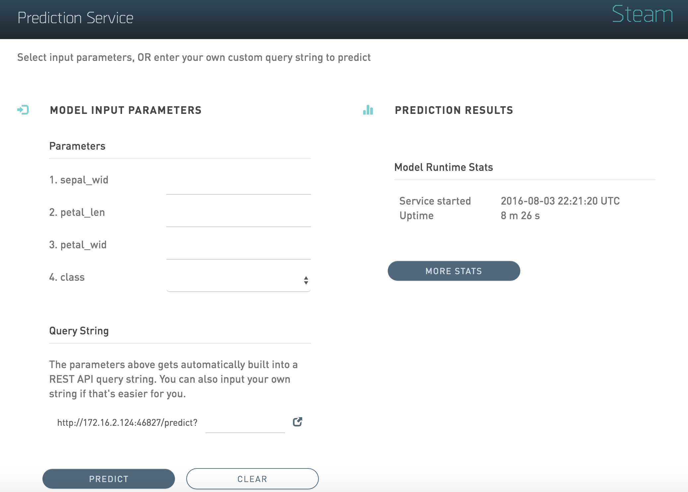

# Deployment

The **Deployment** page lists all available deployed services. For each deployed service, this page shows the model name, model ID, and the status. You can stop a running service by clicking the **Stop Service** button 

In addition to showing deployed services, a Packaging tab is available showing the preprocessing packages used in the deployment.

### Uploading a New Package

Preprocessing packages can be used to perform additional data munging on an existing model. 

1. To upload a new preprocessing package, click the **Upload New Package** button in the upper-right corner of the Deployment page.
2. Specify the main Python file that will be used for preprocessing. Click on the folder link to browse for this file.
3. Specify additional files that may be dependencies of the main Python preprocessing file.
4. Enter a name for this new package.
5. Click **Upload** when you are finished.

Upon successful completion, the new preprocessing package will display on the Packages tab of the Deployment page. This file can then be specified when deploying or exporting models. (Refer to [Deploying a Model](Models.md#deploymodel) or [Exporting a Model](Models.md#exportmodel).)

### Making Predictions

1. To reach the Steam Prediction Service, click the IP address link listed under the Deployed Services for the deployed model that you want to score. This opens Steam Prediction Service tool. The fields that display on the Prediction Service tool are automatically populated with field information from the deployed model.

 

2. Make predictions by specifying input values based on column data from the original dataset. This automatically populates the fields in the query string. (Note that you can optionally include input parameters directly in the query string instead of specifying parameters.)

3. Click **Predict** when you are done. 

>**Note**: Use the **Clear** button to clear all entries and begin a new prediction. Use the **More Stats** button to view additional statistics about the scoring service results.