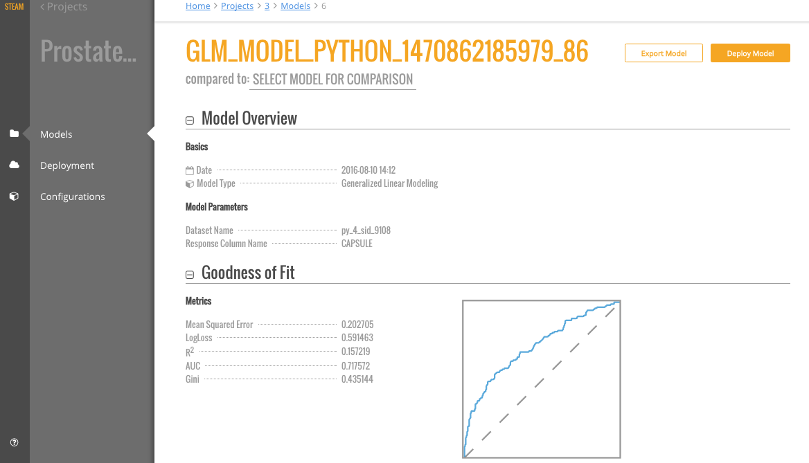
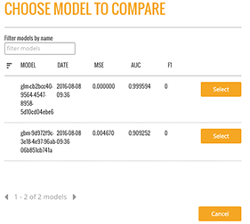
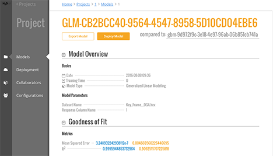
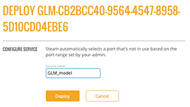

# Models

The **Models** page shows a list of all models 

You can perform the following actions directly from the **Models** page:

- Import a new model
- View model details and export the model as a java, jar, or war file 
- Label a model as a test, staging, or production model
- Deploy the model

## Importing Models

## Viewing Model Details

## Comparing Models

Following is an example of the Model Details page for the "GLM-CB2BCC40-9564-4547-8958-5D10CD04EBE6" model.

As indicated in the previous section, two models were added to this project. From this page, you can compare the GLM and GBM models that were built. 

1. Click the **Compared To** field. This opens a popup showing all models available in the current project.  

 

2. Select to compare the current GLM model with the GBM model. Once a model is selected, the Model Details page immediately populates with the comparison information. 

 

### Deploying a Model in Steam

1. On the Models page, click the **deploy model** link for the model that you want to deploy.
2. Specify a service name for the deployment, then click **Deploy**.

 

3. Upon successful completion, a scoring service will be created for this deployed model. Click the **Deployment** menu option on the left navigation to go to the Deployment page.

 

