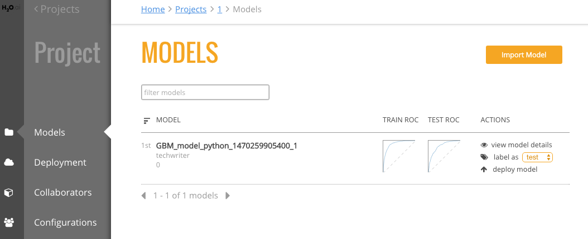

## Models

The **Models** page shows a list of all models included in a selected Project. This list also includes summary information for each model. This information varies based on whether the model is binomial or regresssion.

For binomial models, the following values will display on the Models page.

- AUC
- Gini
- MSE
- Logloss
- ROC

For regression models, the following values will display on the Models page.

- MRD
- MSE
- R^2

You can perform the following actions directly from this page:

- Import a new model
- View model details and export the model as a java, jar, or war file 
- Label a model (refer to [Configurations](Configurations.md) for information on how to create labels)
- Deploy the model

>**Note**: The Models page lists models in alphabetical order and shows five models per page. If your project includes more than five models, use the forward and back arrows at the bottom of the page to view more models. 

### Importing Models

After models are added to an H2O cluster, they can be imported into an existing Steam project. In the upper-right corner of the Models page, click the **Import Models** button. This opens an Import Models popup form.

The Cluster dropdown automatically populates with a list H2O clusters. Specify the H2O cluster that has the models you want to import, then select the additional model or models that you want to add to the project. 

Click **Import** when you are done. The newly added models will then appear on the Models page.

### Viewing Model Details

On the **Models** page, click the **view model details** link under the Action column for the model that you want to view.

This page provides information about when the model was created, the algorithm and dataset used to create the model, and the response column specified when the model was built. The Goodness of Fit section provides value information for the model, including the Mean Squared Error, LogLoss, R^2, AUC, and Gini score. An ROC curve is available for binomial models.  

From this page, you can perform the following actions:

- [Compare two models](#comparemodels)
- [Deploy the model](#deploymodel)
- [Export the model](#exportmodel)

#### Comparing Models

1. While viewing model details, click the **Compared To** field. This opens a popup showing all models available in the current project.  

 

2. Select to compare the current model with any available model. This exampel compares a GLM model with a GBM model. Once a model is selected, the Model Details page immediately populates with the comparison information. The current model values are displayed in blue, and the selected comparison model displays in orange.

 

#### Deploying a Model

After comparing models, you might decide to deploy one or more of the best models. Perform the steps below to deploy a model. 

1. While viewing the model details, click the **Deploy Model** button. (Note that this can also be done directly from the **Models** page by selecting the **deploy model** link in the Action column.)
2. Specify a service name for the deployment.
3. To perform pre-processing on the model, specify a Preprocessing Script. Note that this dropdown is populated with scripts that are added to the project. Information about adding preprocessing scripts is available in the [Deployment](Deployment.md) section. 
4. Click **Deploy** when you are done.

 

3. Upon successful completion, a scoring service will be created for this deployed model. Click the **Deployment** menu option on the left navigation to go to the Deployment page. Refer to the [Deployment Page](Deployment.md) section for more information. 

 

#### Exporting a Model

Steam allows you to export models to your local machine. 

1. While viewing the model details, click the **Export Model** button. 
2. Specify whether to export the model as a .java, .jar, or .war file.
3.  To perform pre-processing on the model during the export, specify a Preprocessing Script. Note that this dropdown is populated with scripts that are added to the project. Information about adding preprocessing scripts is available in the [Deployment](#Deployment.md) section. 
4. Click **Download** when you are done.

 
