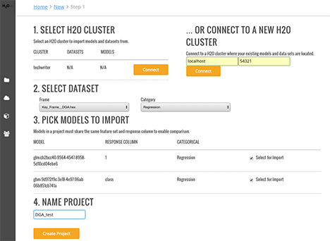

# Projects

Steam makes use of project-based machine learning. Whether you are trying to detect fraud or predict user retention, the datasets, models, and test results are stored and saved in the individual projects. And all Steam users within your environment have access to these projects. 

## Creating a Project

1. To start a new project from scratch, click **Create New Project**. This opens a page showing you the available H2O clusters. 

 

2. When you first log in to Steam, the list of clusters will be empty. Enter your cluster IP address, then click **Connect**. Once connected, this will immediately populate the current list of clusters.
3. Select the H2O frame from the Datasets dropdown, then select the Category.
4. Select the checkbox beside the model(s) to import into the Steam project. In this example, two models are available on the H2O cluster: one model built using GBM and one model built using GLM. Both models were built using the "DGA" dataset. 
5. Specify a name for the project.

 

6. Click **Create Project** when you are done. Upon successful completion, the Models page will be populated with the model(s) that you added to your project, and the new project will be available on the **Projects** page.

 

7. On the **Projects** page, click on the newly created project. 

 
 
 This opens a submenu allowing you to view the available imported models, deployed models, and configurations specific to that project. Information about these topics are available in the sections that follow.
 
 