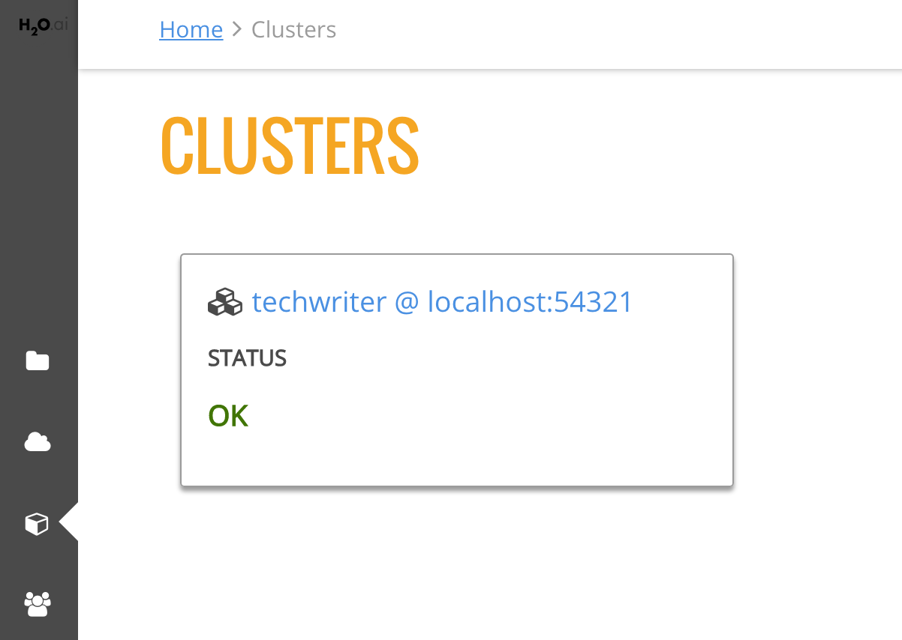

## Using Steam with H2O Flow

As with other H2O products, Flow can be used alongside Steam when performing machine learning tasks.

Navigate to the Clusters page in Steam and click the link for the H2O cluster that you want to open. 

   

This opens H2O Flow in a new tab.

   

***Note***: Refer to the H2O Flow documentation for information on how to use Flow. 
