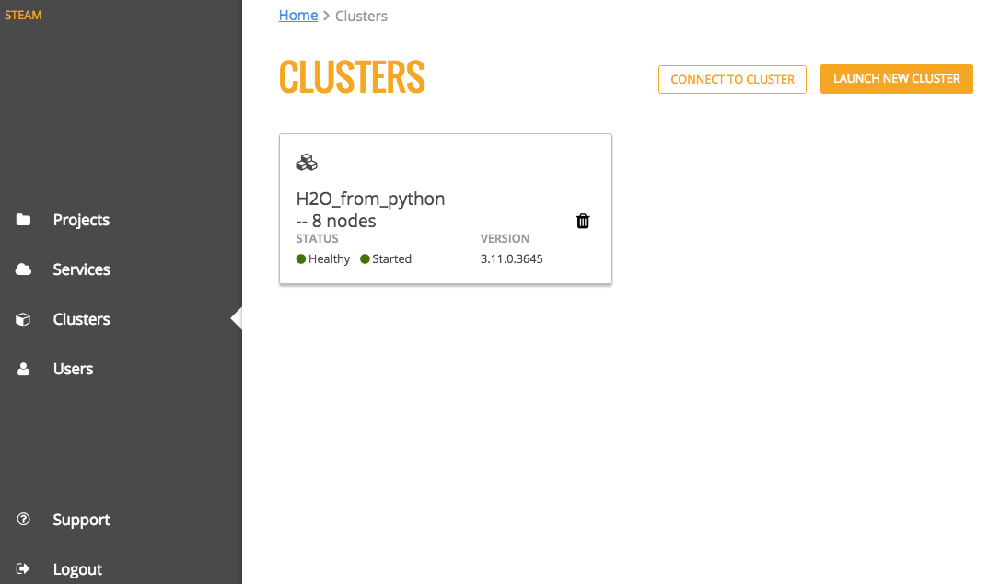

Clusters
========

The **Clusters** page shows all H2O clusters that Steam is connected to along with the status of the cluster, the number of nodes available on the cluster, and the version of H2O currently running on the cluster. From this page, you can click the cluster name to access H2O Flow (see `Using Steam with H2O Flow <UseSteamWithFlow.html>`__), launch a new cluster, or delete a cluster.

Launch a New Cluster
--------------------

You can connect to additional clusters that are running H2O by clicking the **Launch New Cluster** button.

.. figure:: images/launch_new_cluster.png
   :alt: Launch new cluster

1. On the Launch New Cluster form, enter the following information:

 - Cluster Name
 - Number of Nodes
 - Memory per Node (in GB)
 - H2O version (specify a zip file or upload an engine)

2. Click **Launch New Clusters** when you are done. 
