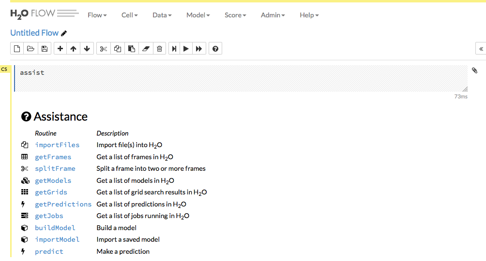

Using Steam with H2O Flow
=========================

As with other H2O products, Flow can be used alongside Steam when
performing machine learning tasks. On the **Clusters** page, click the
cluster name of the H2O cluster that you want to open.

This opens H2O Flow in a new tab.

**Note**: Refer to the `H2O Flow documentation <http://docs.h2o.ai/h2o/latest-stable/h2o-docs/flow.html>`__ for information on how to use Flow.
