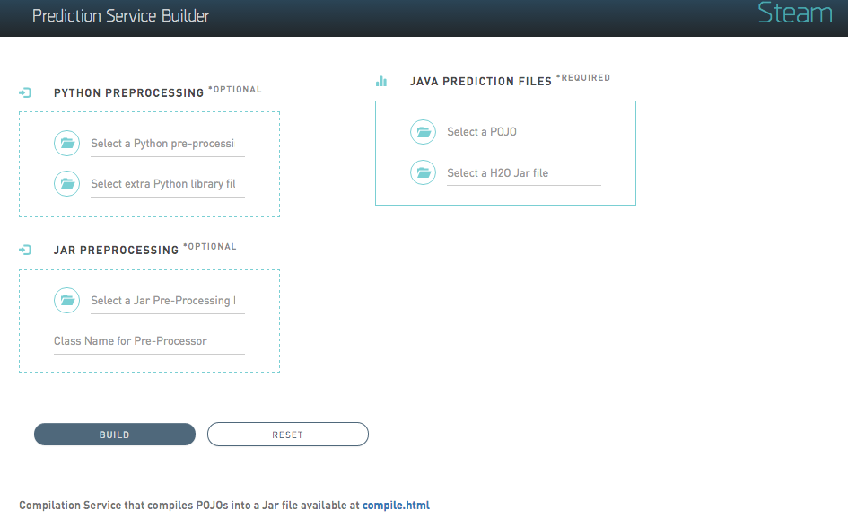
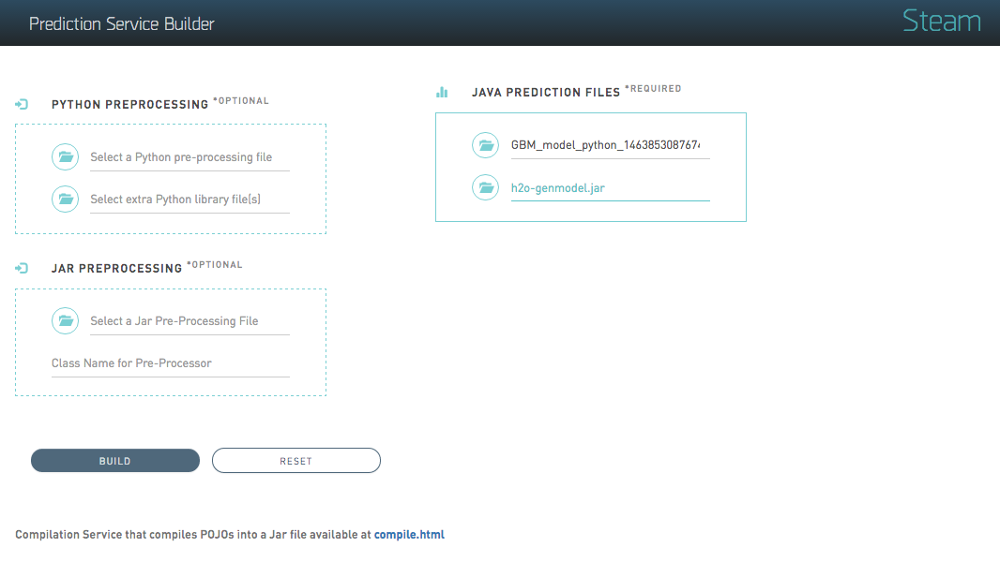
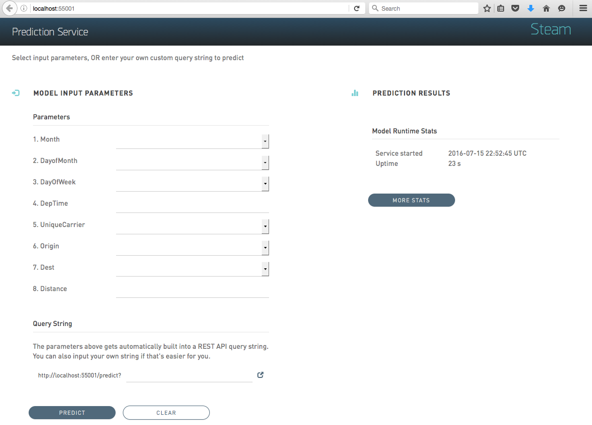
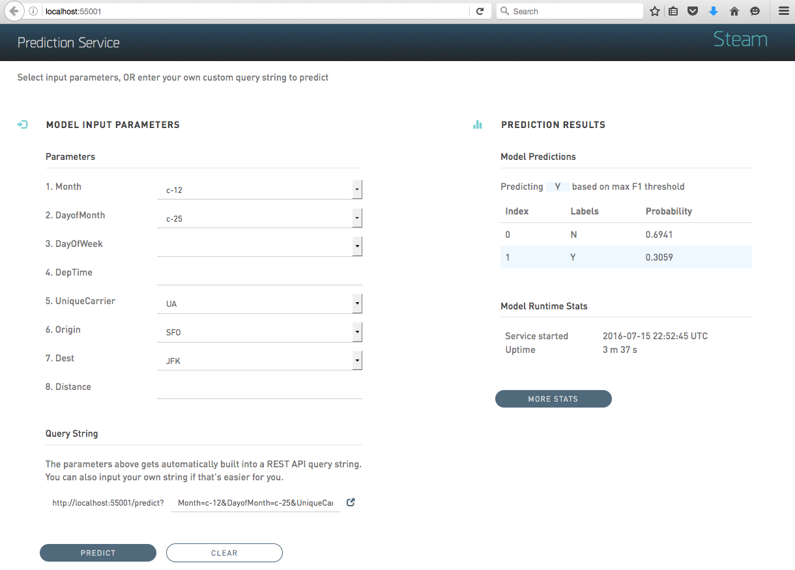

# H2O Prediction Service Builder

The H2O Prediction Service Builder is a standalone web service application that allows you to perform the following through either a web UI or from the command line:

1. Compile one or more Java files (POJOs), and then build a Jar file from a POJO and a gen-model file
2. Compile a POJO or model (MOJO) and build a War file that is a web service from a POJO/MOJO, gen-model. 
You can then run the war file with Jetty, Tomcat, and more
3. Build a War file with a POJO/MOJO predictor and Python pre-preprocessing
4. Build a War file with a POJO/MOJO predictor and preprocessing from a Jar file.
This enables use of languages such as Java, Scala, Clojure, Jython, JRuby, and Groovy for arbitrary preprocessing

### Notes

All code is compiled to Java 1.6 to make it useable with rJava for R.

If you use an older version of Java, you will need to use an older jetty-runner. Jetty 9.3 requires Java 1.8. Jetty 9.0-9.2 requires Java 1.7. Jetty 8 requires Java 1.6.
Testing has been done on Java 1.6-1.8. For Java 1.8, you can use all Jetty runners. For Java 1.7, you can use all except the 9.3 version. For Java 1.6, you need Jetty 8.

Not all Jetty Jar files work. There's a working Jar for each Jetty version included in this distribution.

## Build and Run the Builder Service

Perform the following steps to build the H2O Prediction Service Builder:

1. In a terminal window, navigate to the **steam/prediction-service-builder** folder.

2. Run `./gradlew build` to build the service.

3. You will see a **BUILD SUCCESSFUL** message upon completion. Run 	`./gradlew jettyRunWar` to run the builder service.

4. Open a browser and navigate to localhost:55000 to begin using the H2O Prediction Service Builder web UI. 

	

## Running an Example War File

### Using the Web UI

When the Builder Service is running, you can make a War file using the Web UI.

The following screenshot shows how to make a War file using a POJO file and a Jar file, which are specified in the **JAVA PREDICTION FILES SECTION**. An example model and an H2O Jar file are included in the  **steam/prediction-service-builder/examples/pojo-server** folder. 

Click **Upload** to upload the files to the Prediction Service Builder and create a War file.

>***Note***: You can also build a War file using a model with an additional pre-processing step. There are two options for this: Python or Java/Scala.

> Python. Specify a Python file and additional pre-processing python files and use `makewarpython`. When these files are specified, the prediction file will perform additional pre-processing on the specified model before predicting with the model POJO.

> Java/Scala/Jar. Specify a Jar file that contains everyting you need, then the name of the Class that performs the preprocessing. Use the regular `makewar`. When these files are specified, the prediction file will perform additional pre-processing on the specified model before predicting with the model POJO..

>For testing, an example python file is available in the **/prediction-service/builder/examples/spam-detection-python** folder. The additional python files are available in the **/prediction-service/builder/examples/spam-detection-python/lib** folder.

### Using the CLI

Note that when the Builder Service is running, you can also make a war file using command line arguments. For example:

	curl -X POST --form pojo=@examples/pojo-server/gbm_3f258f27_f0ad_4520_b6a5_3d2bb4a9b0ff.java --form jar=@examples/pojo-server/h2o-genmodel.jar localhost:55000/makewar > example.war

 where:
 
 - `gbm_3f258f27_f0ad_4520_b6a5_3d2bb4a9b0ff.java` is the POJO file from H2O
 - `h2o-genmodel.jar` is the corresponding Jar file from your version of H2O

The POJO and Jar files are included in the **steam/prediction-service-builder/examples/pojo-server** folder.

## Starting the H2O Prediction Service

You can start the H2O Prediction Service using the CLI, or you can run the example scripts included with this package. Running the scripts will automatically start the H2O Prediction Service. 

### Using the CLI

Open a terminal window and run the following command to run the prediction service using the gbm_3f258f27_f0ad_4520_b6a5_3d2bb4a9b0ff.war file that was just built:

		java -jar jetty-runner-9.3.9.M1.jar --port 55001 ~/Downloads/gbm_3f258f27_f0ad_4520_b6a5_3d2bb4a9b0ff.war

This starts the H2O Prediction Service at localhost:55001. You can use this web service at http://localhost:55001.

### Using example.sh

This distribution includes scripts that can be used to quickly get your prediction service up and running. 

Open a terminal window and run the following commands from the **steam/steam-prediction-service** folder. 

	# Run an example using the airline dataset
	cd examples/pojo-server
	sh example.sh
	sh run-example.sh

or

	# Run an example using the spam-detection dataset
	cd examples/spam-detection-python
	sh example-python.sh
	sh run-example-python.sh

These example scripts generate a War file and then start the prediction service at http://localhost:55001
using a subset of either the airline or spam-detection dataset.

**Note**: If you run the example-python.sh and run-example-python.sh files, be sure to install textblob (`pip install textblob`) so that the python example runs properly.

## Making Predictions

### Using the Web UI

The Prediction Service includes a list of the model input parameters that you can specify when making a prediction.
The parameters are based on the column headers from the dataset that was used to build the model.

Specify a set of prediction values, or enter an input values query string, then click **Predict** to view the prediction.

### Using the CLI

**GET**

You can send a GET request with the input variables as the query string. 
	
	curl "localhost:55001/predict?Dest=JFK"

This returns a JSON result:

	{"labelIndex":1,"label":"Y","classProbabilities":[0.026513747179178093,0.9734862528208219]}

The predictor has two classes. "Y" was predicted with a probability of 97%.

**POST**

JSON can be sent using a POST request. 

	curl -X POST --data '{Dest: JFK}' localhost:55001/predict

This returns a JSON result:

	{"labelIndex":1,"label":"Y","classProbabilities":[0.026513747179178093,0.9734862528208219]} 

**Batch POST**

You can also send multiple JSON inputs at the same time as a batch. Each JSON input has to be on a separate line.
If the file `jsonlines.txt` contains

    {"Dest":"JFK"}
    {"Dest":"SFO"}
    {"Dest":"JFK"}

The command

    curl -X POST --data-binary @jsonlines.txt  http://localhost:55001/predict

then returns

    {"labelIndex":1,"label":"Y","classProbabilities":[0.026513747179178093,0.9734862528208219]}
    {"labelIndex":1,"label":"Y","classProbabilities":[0.008905417583984554,0.9910945824160154]}
    {"labelIndex":1,"label":"Y","classProbabilities":[0.026513747179178093,0.9734862528208219]}

## H2O Prediction Run-Time Stats

Prediction statistics are provided in the web page for the predictor and as a web service in JSON at

    http://localhost:55001/stats

- When the service was started in UTC and its uptime in days
- When the last prediction was run in UTC and how long ago that was in days
- How long time the last prediction took in milliseconds
- Total and average prediction time, with and without skipping the first 5 predictions (warmup)
- There are separate sections for
    - pure predictions using the pojo
    - GET and POST for POJOs
    - GET and POST for POJOs with Python preprocessing
- GET and POST statistics include the time from when the service recieves the input until it returns the result

Click the **More Stats** button to view more Prediction Service statistics.

