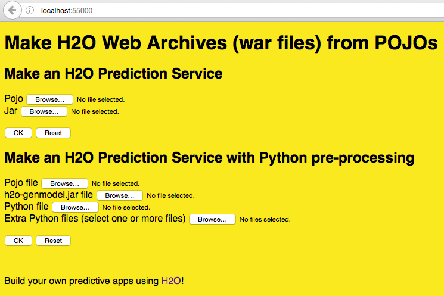
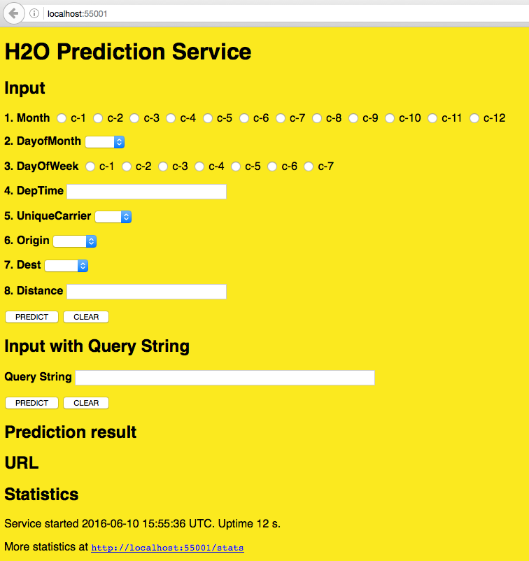
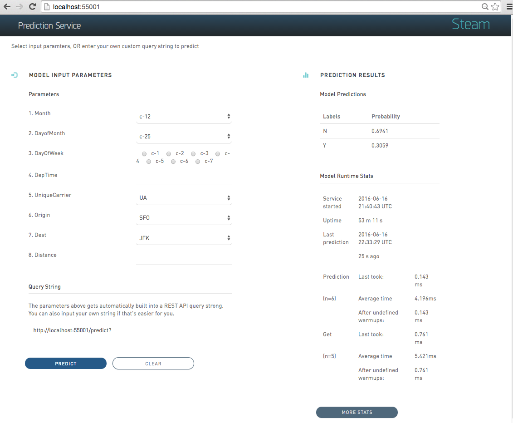

# H2O Scoring Service Builder

The H2O Scoring Service Builder is an application that allows you to perform the following through either a web UI or command line:

1. Compile a POJO, and then build a Jar file from a POJO and a gen-model file
2. Compile the POJO, and then build a War file that is a service from a POJO, gen-model. You can then run the war file in Jetty, Tomcat, etc.
3. Build a War file with a POJO predictor and Python pre-preprocessing

## Notes

All code is currently compiled to Java 1.6 to make it useable with rJava.

If you use an older version of Java, you will need to use an older jetty-runner. Jetty 9.3 requires Java 1.8. Jetty 9.0-9.2 requires Java 1.7. Jetty 8 requires Java 1.6.

Testing has been done on Java 1.6-1.8. For Java 1.8, you can use all Jetty runners. For Java 1.7, you can use all except the 9.3 version. For Java 1.6, you need Jetty 8.

## Build and Run the Builder Service

Perform the following steps to build the H2O Scoring Service Builder:

1. In a terminal window, navigate to the **steamY/scoring-service-builder** folder.

2. Run `./gradlew build` to build the service.

3. You will see a **BUILD SUCCESSFUL** message upon completion. Run 	`./gradlew jettyRunWar` to run the builder service.

4. Open a browser and navigate to localhost:55000 to begin using the H2O Scoring Service Builder web UI. 

	

## Running an Example War File

### Using the Web UI

When the Builder Service is running, you can make a War file using the Web UI.

The following screenshot shows how to make a War file using a POJO file and a Jar file, which are specified in the **JAVA PREDICTION FILES SECTION**. An example model and an H2O Jar file are included in the  **steamY/scoring-service-builder/examples/example-pojo** folder. 

Click **Upload** to upload the files to the Prediction Service Builder and create a War file.

>***Note***: You can also build a War file using a model with an additional pre-processing step. To do this, specify a Python file and additional pre-processing python files. When these files are specified, the prediction file will perform additional pre-processing on the specified model before completing the War file. 

>For testing, an example python file is available in the **/scoring-service/builder/examples/example-spam-detection** folder. The additional python files are available in the **/scoring-service/builder/examples/example-spam-detection/lib** folder.  

### Using the CLI

Note that when the Builder Service is running, you can also make a war file using command line arguments. For example:

		curl curl -X POST --form pojo=@examples/example-pojo/gbm_3f258f27_f0ad_4520_b6a5_3d2bb4a9b0ff.java --form jar=@examples/example-pojo/h2o-genmodel.jar localhost:55000/makewar > example.war

 where:
 
 - `gbm_3f258f27_f0ad_4520_b6a5_3d2bb4a9b0ff.java` is the POJO file from H2O
 - `h2o-genmodel.jar` is the corresponding Jar file from your version of H2O

The POJO and Jar files are included in the **steamY/scoring-service-builder/examples/example-pojo** folder. 

When the H2O Scoring Service Builder is up and running, open another terminal window, navigate to the **steamY/scoring-service-builder** folder, and run the following command to import the war file into the H2O Prediction service.

		java -jar jetty-runner-9.3.9.M1.jar --port 55001 exmaple.war

This starts the H2O Prediction Service at localhost:55001. You can this web service at http://localhost:55001.

## Starting the H2O Prediction Service

### Using the CLI

When the H2O Scoring Service Builder is up and running, open another terminal window, navigate to the **steamY/scoring-service-builder** folder, and run the following command to import the war file into the H2O Prediction service.

		java -jar jetty-runner-9.3.9.M1.jar --port 55001 exmaple.war

This starts the H2O Prediction Service at localhost:55001. You can this web service at http://localhost:55001.

### Using example.sh

This distribution includes an **example.sh** file, which can be run to quickly get your prediction service up and running. 

Open a terminal window and run the following commands from the **steamY/steam-scoring-service** folder. 

	example.sh
	run-example.sh

These example scripts generate a War file and then start the prediction service. 

## Making Predictions

### Using the Web UI

The Prediction Service includes a list of the model input parameters that you can specify when making a prediction. The parameters are based on the column headers from the dataset that was used to build the model.

Specify a set of prediction values OR enter an input values query string, then click **Predict** to view the prediction.

### Using the CLI

**GET**

You can send a GET request with the input variables as the query string. 
	
	curl GET "localhost:55001/predict?Dest=JFK"

This returns a JSON result:

	{"labelIndex":1,"label":"Y","classProbabilities":[0.026513747179178093,0.9734862528208219]}

The predictor has two classes. "Y" was predicted with a probability of 97%.

**POST**
JSON can be sent using a POST request. 

	curl POST -d '{Dest: JFK}' localhost:55001/predict

This returns a JSON result:

	{"labelIndex":1,"label":"Y","classProbabilities":[0.026513747179178093,0.9734862528208219]} 

## H2O Prediction Run-Time Stats

Prediction statistics are provided as a web service and in the web page for the predictor:

- When the service was started and its uptime in days
- When the last prediction was run and how long ago that was in days
- How long time the last prediction took in milliseconds
- Total and average prediction time, with and without skipping the first 5 predictions (warmup)

Click the **More Stats** button to view more Prediction Service stats.
