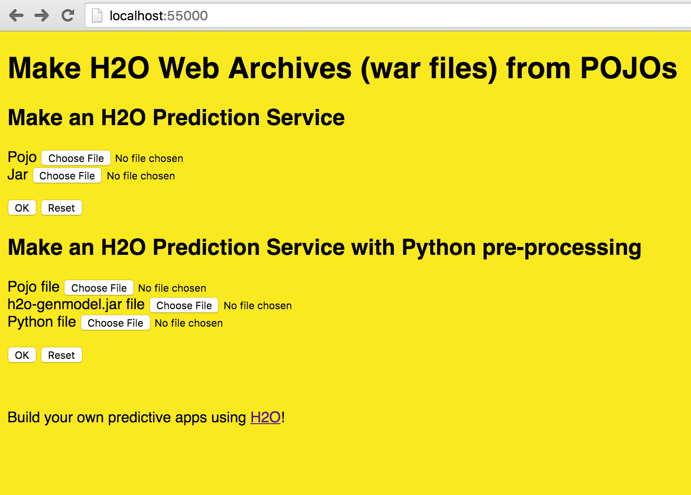

# H2O Scoring Service Builder
This is a service that can
1. Compile the Pojo and build a Jar file from a Pojo and a gen-model file
2. Compile the Pojo and build a War file that is a service from a Pojo, gen-model.
You can then run the war file in Jetty, Tomcat, etc.
3. Build a War file with a Pojo predictor and Pyhton pre-preprocessing

## Build the Builder Service

`./gradlew build
`
## Run the Builder Service
`./gradlew jettyRunWar
`

starts a web server on localhost:55000

This web server can build a WAR file from an H2O Pojo,
h2o-genmodel.jar file and a an extra jar file. Example files are in
directory examples/example-pojo.

`curl -X POST --form pojo=@examples/example-pojo/gbm_3f258f27_f0ad_4520_b6a5_3d2bb4a9b0ff.java --form jar=@examples/example-pojo/h2o-genmodel.jar localhost:55000/makewar > example.war
`

This is in `example.sh`.


`gbm_3f258f27_f0ad_4520_b6a5_3d2bb4a9b0ff.java` is the Pojo from
H2O. `h2o-genmodel.jar` is the corresponding jar file from the version
of H2O.

If you go to http://localhost:55000 you get a web page with a form that
can be used to create war files.



**Note** You no longer need to send the extra file that was needed earlier.

### Prediction server


The result of the service above is a war file that can be run with

`java -jar jetty-runner-9.3.9.M1.jar --port 55001 example.war
`

This in turn starts a web service at localhost:55001 .
There is also a web page for the predictor at http://localhost:55001 .


### Using Get

You can send a Get request with the input variables as the query string.

`curl "localhost:55001/predict?Dest=JFK"`

which returns a JSON result

`{"labelIndex":1,"label":"Y","classProbabilities":[0.026513747179178093,0.9734862528208219]}
`

The predictor has two classes. "Y" was predicted with probability 97%.

### Using Post

Json can be sent using a Post request.

`curl -d '{Dest: JFK}' localhost:55001/predict`

which returns a JSON result

`{"labelIndex":1,"label":"Y","classProbabilities":[0.026513747179178093,0.9734862528208219]}
`

## Prediction server with Python preprocessing

To enable Python pre-processing you can build a Predictin Service with that built-in.

__TODO__ do the new example with spam detection.


### Using Get

```
curl  'http://localhost:55001/pypredict?,,,4,UA,JFK,SFO,8'
{"labelIndex":1,"label":"Y","classProbabilities":[0.15612585314337513,0.8438741468566249]}
```


You can send a Get request with the input variables as the query string.
TODO
`curl "localhost:8081/pypredict?Dest=JFK"`

which returns a JSON result

`{"labelIndex":1,"label":"Y","classProbabilities":[0.026513747179178093,0.9734862528208219]}
`

The predictor has two classes. "Y" was predicted with probability 97%.

### Using Post

Json can be sent using a Post request.
TODO
`curl -d '{Dest: JFK}' localhost:8081/pypredict`

which returns a JSON result

`{"labelIndex":1,"label":"Y","classProbabilities":[0.026513747179178093,0.9734862528208219]}
`

## Prediction statistics

Prediction statistics are provided as a web service and in the web page for the predictor:
 + When the service was started and it's uptime in days
 + When the last prediction was run and how long ago that was in days
 + How long time the last prediction took in milliseconds
 + Total and average prediction time, with and without skipping the first 5 predictions (warmup)

__TODO__ also stats got Get, Post for regular and python services

Web service:

`http://localhost:55001/stats`

## Jetty runner versions

All code is currently compiled to Java 1.6 to make it useable with rJava.
It's fine to use Jetty 8.

If you use an older Java version, you need to use an older
jetty-runner. Jetty 9.3 requires Java 1.8. Jetty 9.0-9.2 requires Java
1.7. Jetty 8 requires Java 1.6. 

Testing has been done on Java 1.6-1.8. For Java 1.8 you can use
all jetty runners while on Java 1.7 you can use all except the 9.3
version. For Java 1.6 you need Jetty 8.

